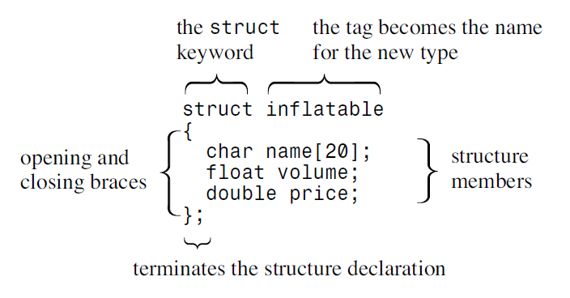

# C++ :: [C++ Primer Plus](.Books\C++_Primer_Plus,_Sixth_Edition,_2012,_Stephan_Prata.pdf)

## Chapter 1: Getting Started

Computer language deal with 2 concepts: DATA (information) & ALGORITHMS (methods)

C++ joins three programming categories:

- *C*   - Procedural language
- *C++* - Object-oriented language, represented by: class enhancements
- *C++* - Generic programming (eg. write function for a generic (unspecified) type once and use it for variety of actual types)

**Object-Oriented Programming (OOP):**

* *Class* - Defines what data is used to represent object and what operations can be performed on it; data form; [name, date, ...]
* *Object* - data structure; [David, 19.01.2000, ...]

Bottom-up programming - going from lower level (eg. classes) to higher (eg. program design) OOP facilitates creating reusable code with:

- *Information hiding* - safeguard from improper access
- *Polymorphism* - allows creating multiple definitions for operators and functions
- *Inheritance* - allows deriving new classes from old ones

**Mechanics of creating a Program:**

1. Write and save program: source code ``code.cpp``
2. Compile the source code: translation to machine language ``gcc ./code.cpp``
3. Link with additional code: libraries, functions; The output is executable code

**Common phrases:**

- *Compile* - Compile code in the file you are currently in
- *Build/Make* - Compile code for all source code files in the project
- *Build All* - Compile all source code files from scratch
- *Link* - Combine compiled source code with necessary library code
- *Run/Execute* - Run the program ./prog or exe
- *Debug* - Run program with option of going  through step-by-step

## Chapter 2: Setting Out to C++

<details style="margin-left: 35px;">
    <summary style="margin-left: -35px;">
        List of what you will learn
    </summary>

```
    1. Creation and format of C++ program </br>
    2. The #include directive </br>
    3. The main() function </br>
    4. Using cout object for output </br>
    5. Using cin object for input</br>
    6. How/when use endl</br>
    7. Placing comments in C++ program </br>
    8. Declaring and using variables and functions</br>
```

</details> <br>

***C++ is:***

- `case sensitive` - it distinguish uppercase from lowercase characters
- `spelling sensitive` - kout or coot instead of `cout` will give you error

***Construction of C++ program:***
C++ program is constructed from functions "C++ building blocks".
Typical program is organized to major tasks with separated functions to handle those tasks. Below is simple function named `main()`:

 > [myfirst.cpp](.refs_notes/notes_C++_C++PrimerPlus/myfirst.cpp) 

<details style="margin-left: 110px; text-align: left; position: relative; top: -32px;">
    <summary></summary>
    <figure class="video_container">
        <iframe 
            src=".refs_notes/notes_C++_C++PrimerPlus/myfirst.cpp" 
            frameborder="10" 
            allowfullscreen="true" 
            height="300px"
            width="100%">
        </iframe>
    </figure>
</details>


```cpp
// myfirst.cpp -- displays a message

#include <iostream>                          // a PREPROCESSOR directive
int main()                                   // function header
{                                            // start of function body
    using namespace std;                     // make definitions visible
    cout << "Come up and C++ me some time."; // message
    cout << endl;                            // start a new line
    cout << "You won’t regret it!" << endl;  // more output
    return 0;                                // terminate main()
} // end of function body
```

The fundamental structure of program (listing) above is:

```cpp
int main()
{
    statements
    return 0;
}
```

It have two parts: function header `int main()` and function body enclosed in brackets. `<br>`

C++ uses `preprocerssor` - Program, that process a source file before the main compilation takes place; directives whose names begins with `#`. Program above uses `#include` directive (thus they are named include files - they are included in other files/included at the beggining) of `iostream` file that is responsible with communication with external world (input/output).

- `using namespace std` - use all namespace directives from std library `std::`
- `using std::cout` - use only one `std::` qualifier
- `cout` - predefined object that knows how to display variety of things
- ***Operator Overloading*** - the same operator with different meanings, eg.: "`<<`" is insertion operator and bitwise left-shift operator. The meaning is defined by context.
- `endl` - Moves screen coursor to the new line; equvalent to newline character "`\n`" from C, but `endl` guarantees that output will be `flushed`. Special notations (to `cout`) like this are called `manipulators`
- ***tokens*** - indivisible elements in a line of code, eg.: `int`

---

***Statements***

To store information on a computer you need:

- identify storage location
- identify how much storage information requires
- ***C++ program*** - collection of functions.
- ***Function*** - collection of statements.
- `=` - assignment operator from right to left (assign value to a storage location).
- `<<` - insertion operator - defined in *ostream* class
- ``>>`` - extraction operator - defined in *istream* class

```cpp
/* 
- declaration statement 
- definition - variable is declared and it causes compiler to allocate memory space
 for variable. Declaration don't need to be the definition (something is declared
 but it don't need to have allocated space)
 */
int x;  

x = 10; // - assignement statement - provide/assign value to variable/storage location 
x = x - 1 // - arithmetic expression 
```

---

*class* - data type that user defines
*to define class* - describe what **information** it can represent and what **action** you can perform on data or in other words

```
x = sqrt(6.25)        -->    function call                 -->    |code for sqrt|   
                                                                        ▼
|assign return to x|  <--    return to calling function    <--    | sqrt return |
```

Argument `6.25` is ***passed*** to a function sqrt

***[function prototype](.refs_notes\notes_C++_C++PrimerPlus\function_prototype.cpp)*** - is for function as variable declaration for variables; decribe the function interface and needs to be before function definition; if you use it you will need to provide prototype in source code or with #include

***function definition*** - code for function workings

***keyword*** - vocabulary of a computer language: *int, void, return, double, etc..* - the list of them is in appendix "C++ Reserved Words"; functions and object names are not keywords

```cpp
//function prototype; initial double is type of returned value from sqrt; 
//double in sqrt(double) is passed argument for sqrt 
double sqrt(double);  
```

***exit values*** - (tested) return values of executed program. default convention: 0 - program ran successfully; >0 - error/problem

- Declaration statement — A declaration statement announces the name and the
  type of a variable used in a function.
- Assignment statement — An assignment statement uses the assignment operator ( = )
  to assign a value to a variable.
- Message statement — A message statement sends a message to an object, initiating
  some sort of action.
- Function call — A function call activates a function.When the called function ter-
  minates, the program returns to the statement in the calling function immediately
  following the function call.
- Function prototype — A function prototype declares the return type for a function,
  along with the number and type of arguments the function expects.
- Return statement — A return statement sends a value from a called function back
  to the calling function.

---

### Chapter Review

<!-- -------------------------------------------- -->

<details style="margin-left: 35px;">
    <summary style="margin-left: -35px;"> 
1. What are the modules of C++ programs called?
    </summary>

```
They are called functions.
```

</details>

<!-- -------------------------------------------- -->

<details style="margin-left: 35px;">
    <summary style="margin-left: -35px;"> 
2. What does the following preprocessor directive do?

``#include <iostream>``

</summary>

```
It causes the contents of the iostream file to be substituted for this directive before
final compilation.
```

</details>

<!-- -------------------------------------------- -->

<details style="margin-left: 35px;">
    <summary style="margin-left: -35px;"> 
3. What does the following statement do?

``using namespace std;``
    </summary>

```
It makes definitions made in the std namespace available to a program.
```

</details>

<!-- -------------------------------------------- -->

<details style="margin-left: 35px;">
    <summary style="margin-left: -35px;"> 
4. What statement would you use to print the phrase “Hello, world” and then start a
new line?
    </summary>

``cout << "Hello, world\n";``
or
``cout << "Hello, world" << endl;``

</details>

<!-- -------------------------------------------- -->

<details style="margin-left: 35px;">
    <summary style="margin-left: -35px;"> 
5. What statement would you use to create an integer variable with the name
cheeses ?
    </summary>

```
int cheeses;
```

</details>

<!-- -------------------------------------------- -->

<details style="margin-left: 35px;">
    <summary style="margin-left: -35px;"> 
6. What statement would you use to assign the value 32 to the variable cheeses ?
    </summary>

```
cheeses = 32;
```

</details>

<!-- -------------------------------------------- -->

<details style="margin-left: 35px;">
    <summary style="margin-left: -35px;"> 
7. What statement would you use to read a value from keyboard input into the vari-
able cheeses ?
    </summary>

```
cin >> cheeses;
```

</details>

<!-- -------------------------------------------- -->

<details style="margin-left: 35px;">
    <summary style="margin-left: -35px;"> 
8. What statement would you use to print “We have X varieties of cheese,” where the
current value of the cheeses variable replaces X ?
    </summary>

``cout << "We have " << cheeses << " varieties of cheese\n";``

</details>

<!-- -------------------------------------------- -->

<details style="margin-left: 35px;">

<summary style="margin-left: -35px;"> 
9. What do the following function prototypes tell you about the functions?

``int prune(void);``<br>
``int froop(double t);``<br>
``void rattle(int n);``

</summary>

The function froop() expects to be called with one argument, which will be type double , and that the function will return a type int value. For instance, it could be used as follows: ``int gval = froop(3.14159);``

The function rattle() has no return value and expects an int argument. For instance, it could be used as follows: ``rattle(37);``

The function prune() returns an int and expects to be used without an argument. For instance, it could be used as follows: ``int residue = prune();``

</details>

<!-- -------------------------------------------- -->

<details style="margin-left: 35px;">
    <summary style="margin-left: -35px;"> 
10.  When do you not have to use the keyword return when you define a function?
    </summary>

```
You don’t have to use return in a function when the function has the return type
void . However, you can use it if you don’t give a return value:
return;
```

</details>

<!-- -------------------------------------------- -->

<details style="margin-left: 35px;">
    <summary style="margin-left: -35px;"> 
11. Suppose your main() function has the following line:

``cout << “Please enter your PIN: “;``
And suppose the compiler complains that cout is an unknown identifier.
What is the likely cause of this complaint, and what are three ways to fix the problem?
    </summary>
***Lack of caller for std library.***
Use directive: ``using namespace std;`` or ``using std::cout`` for only `cout` or call library with `std::cout` instead of `cout`

</details>

---

### Exercises

[1.](.refs_notes\notes_C++_C++PrimerPlus\exercise_ch2_1.cpp) Write a C++ program that displays your name and address (or if you value yourprivacy,a fictitious name and address).

[2.](.refs_notes\notes_C++_C++PrimerPlus\exercise_ch2_2.cpp) Write a C++ program that asks for a distance in furlongs and converts it to yards.(One furlong is 220 yards.)

[3.](.refs_notes\notes_C++_C++PrimerPlus\exercise_ch2_3.cpp) Write a C++ program that uses three user-defined functions (counting `main()` as one) and produces the following output:

```
Three blind mice
Three blind mice
See how they run
See how they run
```

One function,called two times,should produce the first two lines, and the remain-ing function, also called twice, should produce the remaining output.

[4.](.refs_notes\notes_C++_C++PrimerPlus\exercise_ch2_4.cpp) Write a program that asks the user to enter his or her age. The program then should display the age in months:

```
Enter your age: 29
Your age in months is 384.
```

[5.](.refs_notes\notes_C++_C++PrimerPlus\exercise_ch2_5.cpp) Write a program that has `main()` call a user-defined function that takes a Celsius temperature value as an argument and then returns the equivalent Fahrenheit value.The program should request the Celsius value as input from the user and displaythe result,as shown in the following code:

```
Please enter a Celsius value: 20
20 degrees Celsius is 68 degrees Fahrenheit.
```

For reference,here is the formula for making the conversion: `Fahrenheit = 1.8 × degrees Celsius + 32.0`

[6.](.refs_notes\notes_C++_C++PrimerPlus\exercise_ch2_6.cpp)  Write a program that has `main()` call a user-defined function that takes a distance in light years as an argument and then returns the distance in astronomical units.The program should request the light year value as input from the user and display the result,as shown in the following code:

```
Enter the number of light years: 4.2
4.2 light years = 265608 astronomical units.
```

An astronomical unit is the average distance from the earth to the sun (about 150,000,000 km or 93,000,000 miles), and a light year is the distance light travels in a year (about 10 trillion kilometers or 6 trillion miles).
(The nearest star after thesun is about 4.2 light years away.) Use type double (as in Listing 2.4 (page 51)) and this conversion factor:

```
1 light year = 63,240 astronomical units
```

[7.](.refs_notes\notes_C++_C++PrimerPlus\exercise_ch2_7.cpp) Write a program that asks the user to enter an hour value and a minute value. The `main()` function should then pass these two values to a type `void` function that displays the two values in the format shown in the following sample run:

```
Enter the number of hours: 9
Enter the number of minutes: 28
Time: 9:28
```

## Chapter 3: Dealing with Data

<details style="margin-left: 35px;">
    <summary style="margin-left: -35px;">
        List of what you will learn
    </summary>

```
- Rules for naming C++ variables
- C++’s built-in integer types: unsigned long, long, unsigned int, int, unsigned
short, short, char, unsigned char, signed char, bool
- C++11’s additions: unsigned long long and long long
- The climits file, which represents system limits for various integer types
- Numeric literals (constants) of various integer types
- Using the const qualifier to create symbolic constants
- C++’s built-in floating-point types: float, double, and long double
- The cfloat file, which represents system limits for various floating-point types
- Numeric literals of various floating-point types
- C++’s arithmetic operators
- Automatic type conversions
- Forced type conversions (type casts)
```

</details> <br>


**Build-in C++ data types**:
 - fundamental types - integers and floating point numbers 
 - compound types - arrays, strings, pointers and structures, explained in Chapter 4


**To store item of information on a computer you need to track**:
- Where the information is stored
- What value is kept there
- What kind of information is stored

**C++ naming rules**:
- Only characters you can use in names are: alphabetic characters, numeric digits and underscore character
- The first character in a name cannot be a nu,eric digit
- Uppercase characters are considered distinct from lowercase characters
- You can't use C++ keyword for a name
- Names beginning with two underscore characters or with an underscore character followed by an uppercase letter are reseved for use by implementation (the compiler and the resources it uses).
- Names beggining with single underscore character are reserved for use as global identifiers bt the implementation
- C++ places no limits on the length of a name, and all characters in a name are significant (but some platforms can have their own length limits).

Data 
- *width* - term for the amount of memory used to hold variable
- *operator* - build in language element that operates on one or more items to produce a value (addition operator `+` adds two values)
    - *sizeof* - return size in bytes of a tupe or variable
    - *climits* - header file - contain information about integer type limits, check [limits.cpp](.refs_notes\notes_C++_C++PrimerPlus\limits.cpp) 


<details style="margin-left: 35px;">
    <summary style="margin-left: -35px;"> 
    	<a href=".refs_notes\notes_C++_C++PrimerPlus\limits.cpp"> limits.cpp </a>
    </summary>
    <figure>
        <iframe 
            src=".refs_notes\notes_C++_C++PrimerPlus\limits.cpp" 
            frameborder="10" 
            allowfullscreen="true" 
            height="300px"
            width="100%">
        </iframe>
    </figure>
</details>


### Initialization
Combines assignment with declaration, for example:
```cpp
int i_sth = INT_MAX; 
int owls = 101; // traditional C initialization, sets owls to 101
int wrens(432); // alternative C++ syntax, set wrens to 432
``` 

Not initialized variables are **indeterminate** - value is what was previously in memory, assigned to the newly declared variable;

**C++11 initialization:**
- using a braced initializer `{}`
- braces can be left empty, in which case the variable is initialized to 0
- it can be used with or without the = sign
- it provides better protection against type conversion errors (more on end of this chapter)
  
```cpp
int emus{7};        // set emus to 5
int rheas = {12};   // set rheas to 12
int rocs = {};      // set rocs to 0
int psychics{};     // set psychics to
```

-----

Exceeding max value (range of data type) will make value assign the lowest value possible (like odometer).  

Amount of allocated memory for `int` (and thus max range/value) can differ from devices and compilers, but is *natural* (computer handles it most efficiently); `long` type is more reliable (32bit), but worse in other aspects.


### Literals 
Constant values that are assigned to the constant variables.

#### Integer literals 

- *042* - octal value - base 8 
- *42* - decimal value, base 10  
- *0x42* - hexadecimal value - base 16

Example in hexoctl.cpp
<details style="margin-left: 35px;">
    <summary style="margin-left: -35px;"> 
    	<a href=".refs_notes\notes_C++_C++PrimerPlus\hexoct1.cpp"> hexoct1.cpp </a>
    </summary>
    <figure>
        <iframe 
            src=".refs_notes\notes_C++_C++PrimerPlus\hexoct1.cpp" 
            frameborder="10" 
            allowfullscreen="true" 
            height="300px"
            width="100%">
        </iframe>
    </figure>
</details> <br>

You can `cout` manipulators `dec`, `oct`, `hex` for changing numer base.
Example in hexoct2.cpp

<details style="margin-left: 35px;">
    <summary style="margin-left: -35px;"> 
    	<a href=".refs_notes\notes_C++_C++PrimerPlus\hexoct2.cpp"> hexoct2.cpp </a>
    </summary>
    <figure>
        <iframe 
            src=".refs_notes\notes_C++_C++PrimerPlus\hexoct2.cpp" 
            frameborder="10" 
            allowfullscreen="true" 
            height="300px"
            width="100%">
        </iframe>
    </figure>
</details> <br>

#### Character literals
**Suffix** for constant:

`l`, `L` - 32bit long constant
`u`, `U` - unsigned int constant
`ul` (any combination of letters) - unsigned long constant 
`ll`, `LL` - C++11 long long constant 
`ULL` - C++11 unsigned long long constant 

| data  | Stored as  |
|---|---|
| `1500`  | 16bit int  |
|`1500L`| 32bit long |

Characters set, like **ASCII** defines which number defines character. Thus `char` is `int` data type value and operations on it like on ints can be performed. Printed characters are processed through `cout`.

Using single quotation marks, eg. `'A'` for character display is better, because it doesn't assume particular code.

Escape codes represent characters, that you cannot input from keyboard notrmally:

<details style="margin-left: 35px;">
    <summary style="margin-left: -35px;"> 
    	Table of escape codes
    </summary>

|Character Name| ASCII Symbol | C++ Code | ASCII Decimal Code | ASCII Hex Code |
|---|---|---|---|---|---|
| Newline | NL (LF) | \n | 10 | 0xA |
| Horizontal tab | HT |\t | 9 | 0x9 |
| Vertical tab | VT | \v | 11 | 0xB |
| Backspace | BS | \b | 8 | 0x8 |
| Carriage return | CR | \r | 13 | 0xD |
| Alert | BEL | \a | 7 | 0x7 |
| Backslash | \ | \\ | 92 | 0x5C |
| Question mark | ? | \\?  | 63 | 0x3F |
| Single quote | ’ | \\' | 39 | 0x27 |
| Double quote | ” | \\" | 34 | 0x22 |
</details> 


<details style="margin-left: 35px;">
    <summary style="margin-left: -35px;"> 
    	<a href=".refs_notes\notes_C++_C++PrimerPlus\bondini.cpp"> Example of use: bondini.cpp </a>
    </summary>
    <figure>
        <iframe 
            src=".refs_notes\notes_C++_C++PrimerPlus\bondini.cpp" 
            frameborder="10" 
            allowfullscreen="true" 
            height="300px"
            width="100%">
        </iframe>
    </figure>
</details> <br>

**Universal Character Names** - used for international characters like French vowel. It starts with `\u` ot `\U`, eg.: ``` cout << "g\u00E2teau. ``` - **ISO 10646**

`wchar_t` - wide character set - for characters that don't fit within 8-bit bute (eg.: Japanese kanji system). It is 16-bit or larger. `wchar_t` can vary from one implementation to another.

#### C++11 types
 - `char16_t` - unsigned 16-bits, use `u` prefix for `char16_t`, eg.: `u"good"` or `u'R'`
 - `char32_t` - unsigned 32-bits, use `U` prefix for `char32_t` 

### Member function (OOP)
Eg. `cout.put()`, belongs to a class and describes a method for manipulating class data. `put()` is a class member function. `.` is **membersip operator**.
You can use member function only with particular object in that class (in this case `ostream`), such as `cout` class object in this case.

In short: class - `ostream`, class object - `cout`, function name (member function) - `put()`

`cout.put()` is alternative for using `<<` operator to display character.

### *bool* type
C++ interprets nonzero values as *true* and zeros values as *false*
You can use `bool` type to reprsent those values:

```cpp
bool read = true; 
```

The literals true and false can be converted to type int by promotion, with *true* converting to 1 and *false* to 0 and vice-versa:

```cpp
int ans = true;         // ans assigned 1
int promise = false;    // promise assigned 0
bool is_tru = -500;     // any non-zero will be converted to true 
```

### *const* qualifier

- if attempted to change, compilator will give error
- if value is not provided during declaration, it will be unspecified, that you cannot modify  
- you can use *scoping rules* (chapter 9) to limit it to particular function or files (advantage over *#define*, second advantage is you can use const with elaborate types, such as *arrays* or *structures*)

Example of use: 
`const int Months = 12;`

### Floating-Point Numbers

There is two ways of writing floating-point numbers:
- standard, decimal-point notation, eg.: `12.34`
- representing floating-point values is called E notation, eg.: `-3.45E6` *= -3.4 * 10^6* (where `6` - exponent, `3.45` - mantissa).


**Floating-Point Types:**
All three can be the same size. Typically, float is 32 bits, double is 64 bits, and long double is 80, 96, or 128 bits, and range in exponents for all three types is at least *–37 to +37*. You can look in the `cfloat` or `float.h` header files to find the limits for your system.

The program *floatnum.cpp* display limiitations of floating-point numbers precision and previews an *ostream* method called `setf()` from Chapter 17. This call forces output to stay in ***fixed-point notation*** so that you can better see the precision.

<details style="margin-left: 35px;">
    <summary style="margin-left: -35px;"> 
    	<a href=".refs_notes\notes_C++_C++PrimerPlus\floatnum.cpp"> floatnum.cpp </a>
    </summary>
    <figure>
        <iframe 
            src=".refs_notes\notes_C++_C++PrimerPlus\floatnum.cpp" 
            frameborder="10" 
            allowfullscreen="true" 
            height="300px"
            width="100%">
        </iframe>
    </figure>
</details> <br>

**Floating-Point Constants**
Use suffixes for declaration
`f` or `F` - float constant, eg.: `1.234f`
`l` or `L` - long double

```
1.234f // a float constant
2.45E20F // a float constant
2.345324E28 // a double constant
2.2L // a long double constant
```

**Plus and Cons of Floating-Point values**
`-` operations usually are *slightly slower* than integer operations
`-` you can *lose precision* and values: example [fltadd.cpp](.refs_notes\notes_C++_C++PrimerPlus\fltadd.cpp)
`+` represent *values betwewen integers*
`+` can represent a much *greater range of values*, because of the scaling factor

**C++ Arithmetic Operators**
- *operators*: `+`, `-`, `*`, `%`, `/`, `*`
- *operands* - two values used for calculation via *operators* 
- *expression* - combined operator with operands
  
`%` - modulo works only with integers and produces remainder of dividing first value by second. `19 % 6` is `1`, because 6 goes into 19 three times, with a remainder of 1. Practical example: [modulus.cpp](.refs_notes\notes_C++_C++PrimerPlus\modulus.cpp)

`precedence rules` - When more than one operator can be applied to the same operand, C++ uses` precedence rules` to decide which operator is used first.

`int flyingpigs = 3 + 4 * 5; // 35 or 23?`
The arithmetic operators follow the usual algebraic precedence, with multiplication, division, and the taking of the modulus done before addition and subtraction. 

Appendix D,“Operator Precedence,” - The `/` and `*` operators have the same precedence. 
`float logs = 120 / 4 * 5; // 150 or 6?`

When two operators have the same precedence, C++ looks at whether the operators have a `left-to-right associativity` or a `right-to-left associativity`.
Appendix D shows that multiplication and division associate left-to-right.

**Conversion**

- truncation - discarding fractional part in `int`, when converting from floating-point to int value (eg.: `int g(1.123)`)

C++11 - doesn't permit *narrowing* - variable may not be able to represent the assigned value:
```cpp
const int code = 66;
int x = 66;
char c1 {31325}; // narrowing, not allowed
char c2 = {66}; // allowed because char can hold 66
char c3 {code}; // ditto
char c4 = {x}; // not allowed, x is not constant
x = 31325;
char c5 = x; // allowed by this form of initialization
```

 - integral promotion - automatic conversion evaluates expressions, C++
converts `bool`, `char`, `unsigned char`, `signed char`, and `short` values to `int`, eg.: 
```cpp
short chickens = 20; // line 1
short ducks = 35; // line 2
short fowl = chickens + ducks; // line 3
```
For `fowl`, `chickens` and `ducks` got converted (promoted) to `int` for calculation and then result got converted back to `short`. This is because `int` is the computer most *natural type* 

**Type cast conversion**
Is explicit form of conversion
```cpp
(long) thorn // returns a type long conversion of thorn
long (thorn) // returns a type long conversion of thorn
```

The type cast doesn’t alter the thorn variable itself; instead, it creates a new value of the indicated type, which you can then use in an expression, as in the following: 
```cpp
cout << int('Q'); // displays the integer code for 'Q'
```

**Static type cast conversion**

In c++ of the four, the static_cast<> operator, can be used for converting values from one numeric type to another. For example, using it to convert thorn to a type long value looks like this:
```cpp
static_cast<long> (thorn)
```

<details style="margin-left: 35px;">
    <summary style="margin-left: -35px;"> 
    	<a href=".refs_notes\notes_C++_C++PrimerPlus\typecast.cpp"> typecast.cpp </a>
    </summary>
    <figure>
        <iframe 
            src=".refs_notes\notes_C++_C++PrimerPlus\typecast.cpp" 
            frameborder="10" 
            allowfullscreen="true" 
            height="300px"
            width="100%">
        </iframe>
    </figure>
</details> <br>

**`auto` in C++11**

Just use `auto` instead of the type name in an initializing declaration, and the compiler assigns the variable the same type as that of the initializer:
```cpp
auto n = 100; // n is int
auto x = 1.5; // x is double
auto y = 1.3e12L; // y is long double
```

Automatic type deduction becomes much more useful when dealing with complicated types, such as those in the **STL (Standard Template Library)**. For example: 

C++98 code:
```cpp
std::vector<double> scores;
std::vector<double>::iterator pv = scores.begin();
```
C++11 code:
```cpp
std::vector<double> scores;
auto pv = scores.begin();
```

### Chapter Review

<!-- -------------------------------------------- -->

<details style="margin-left: 35px;">
    <summary style="margin-left: -35px;"> 
1. Why does C++ have more than one integer type?
    </summary>


Having more than one integer type lets you choose the type that is best suited to a particular need. For example, you could use `short` to conserve space or `long` to guarantee storage capacity or to find that a particular type speeds up a particular calculation.

</details>


<details style="margin-left: 35px;">
    <summary style="margin-left: -35px;"> 
2. Declare variables matching the following descriptions:<br>
&nbsp&nbsp&nbsp&nbsp&nbsp a. A short integer with the value 80<br>
&nbsp&nbsp&nbsp&nbsp&nbsp b. An unsigned int integer with the value 42,110<br>
&nbsp&nbsp&nbsp&nbsp&nbsp c. An integer with the value 3,000,000,000
    </summary>

```cpp
short rbis = 80; // or short int rbis = 80;
unsigned int q = 42110; // or unsigned q = 42110;
unsigned long ants = 3000000000;
// or long long ants = 3000000000;

//Note: Don’t count on int being large enough to hold 3,000,000,000.Also if your
//system supports universal list-initialization, you could use it:
short rbis = {80}; // = is optional
unsigned int q {42110}; // could use = {42110}
long long ants {3000000000};
```
</details>

<details style="margin-left: 35px;">
    <summary style="margin-left: -35px;"> 
3. What safeguards does C++ provide to keep you from exceeding the limits of an
integer type?
    </summary>

C++ provides no automatic safeguards to keep you from exceeding integer limits;
you can use the climits header file to determine what the limits are.
</details>

<details style="margin-left: 35px;">
    <summary style="margin-left: -35px;"> 
4. What is the distinction between 33L and 33?
    </summary>

The constant 33L is type long, whereas the constant 33 is type int.
</details>

<details style="margin-left: 35px;">
    <summary style="margin-left: -35px;"> 
5. Consider the two C++ statements that follow:

```cpp
char grade = 65;
char grade = 'A';
```
Are they equivalent?
    </summary>

The two statements are not really equivalent, although they have the same effect on some systems. Most importantly, the first statement assigns the letter `A` to grade only on a system using the `ASCII` code, while the second statement also works for other codes. Second, `65` is a type int constant, whereas `'A'` is a type char constant.
</details>


<details style="margin-left: 35px;">
    <summary style="margin-left: -35px;"> 
6. How could you use C++ to find out which character the code 88 represents?
Come up with at least two ways.
    </summary>

Here are four ways:
```cpp
char c = 88;
cout << c << endl; // char type prints as character
cout.put(char(88)); // put() prints char as character
cout << char(88) << endl; // new-style type cast value to char
cout << (char)88 << endl; // old-style type cast value to char
```
</details>


<details style="margin-left: 35px;">
    <summary style="margin-left: -35px;"> 
7. Assigning a `long` value to a `float` can result in a rounding error. What about assigning `long` to `double`? `long long` to `double`?
    </summary>

The answer depends on how large the two types are. If `long` is 4 bytes, there is no loss. That’s because the largest `long` value would be about 2 billion, which is 10 digits. Because `double` provides at least 13 significant figures, no rounding would be needed. The `long long` type, on the other hand, can reach 19 digits, which exceeds the 13 significant figures guaranteed for `double`.
</details>


<details style="margin-left: 35px;">
    <summary style="margin-left: -35px;"> 
8. Evaluate the following expressions as C++ would:

```cpp
a. 8 * 9 + 2 
b. 6 * 3 / 4 
c. 3 / 4 * 6 
d. 6.0 * 3 / 4 
e. 15 % 4 
```

</summary>

```cpp
a. 8 * 9 + 2 is 72 + 2 is 74
b. 6 * 3 / 4 is 18 / 4 is 4
c. 3 / 4 * 6 is 0 * 6 is 0
d. 6.0 * 3 / 4 is 18.0 / 4 is 4.5
e. 15 % 4 is 3
```
</details>


<details style="margin-left: 35px;">
    <summary style="margin-left: -35px;"> 
9.  Suppose `x1` and `x2` are two type `double` variables that you want to add as `integers` and assign to an `integer` variable. Construct a C++ statement for doing so. What if you want to add them as type `double` and then convert to `int`?

</summary>

Either of the following would work for the first task:
```cpp
int pos = (int) x1 + (int) x2;
int pos = int(x1) + int(x2);
```
To add them as type double and then convert, you could do either of the following:
```cpp
int pos = (int) (x1 + x2);
int pos = int(x1 + x2);
```
</details>

<details style="margin-left: 35px;">
    <summary style="margin-left: -35px;"> 
10.  What is the variable type for each of the following declarations?

```cpp
a. `auto cars = 15;` 
b. `auto iou = 150.37f;`
c. `auto level = 'B';` 
d. `auto crat = U'/U00002155';` 
e. `auto fract = 8.25f/2.5;` 
```

</summary>

```cpp
a. int
b. float
c. char
d. char32_t
e. double
```
</details>

### Programming Exercises
[1.](.refs_notes\notes_C++_C++PrimerPlus\exercise_ch3_1.cpp) Write a short program that asks for your height in integer inches and then converts your height to feet and inches. Have the program use the underscore character to indicate where to type the response. Also use a const symbolic constant to represent the conversion factor.

[2.](.refs_notes\notes_C++_C++PrimerPlus\exercise_ch3_2.cpp)  Write a short program that asks for your height in feet and inches and your weight in pounds. (Use three variables to store the information.) Have the program report your body mass index (BMI).To calculate the BMI, first convert your height in feet and inches to your height in inches (1 foot = 12 inches). Then convert your height in inches to your height in meters by multiplying by 0.0254.Then convert your weight in pounds into your mass in kilograms by dividing by 2.2. Finally, compute your BMI by dividing your mass in kilograms by the square of your height in meters. Use symbolic constants to represent the various conversion factors.

[3.](.refs_notes\notes_C++_C++PrimerPlus\exercise_ch3_3.cpp) Write a program that asks the user to enter a latitude in degrees, minutes, and seconds and that then displays the latitude in decimal format.There are 60 seconds of arc to a minute and 60 minutes of arc to a degree; represent these values with symbolic constants.You should use a separate variable for each input value. A sample run should look like this:

```cpp
Enter a latitude in degrees, minutes, and seconds:
First, enter the degrees: 37
Next, enter the minutes of arc: 51
Finally, enter the seconds of arc: 19
37 degrees, 51 minutes, 19 seconds = 37.8553 degrees
```

[4.](.refs_notes\notes_C++_C++PrimerPlus\exercise_ch3_4.cpp) Write a program that asks the user to enter the number of seconds as an integer value (use type long, or, if available, long long) and that then displays the equivalent time in days, hours, minutes, and seconds. Use symbolic constants to represent the number of hours in the day, the number of minutes in an hour, and the number of seconds in a minute.The output should look like this:
```cpp
Enter the number of seconds: 31600000 
31600000 seconds = 365 days, 17 hours, 46 minutes, 40 seconds
```

[5.](.refs_notes\notes_C++_C++PrimerPlus\exercise_ch3_5.cpp) Write a program that requests the user to enter the current world population and the current population of the U.S. (or of some other nation of your choice). Store the information in variables of type long long. Have the program display the percent that the U.S. (or other nation’s) population is of the world’s population.The output should look something like this:
```cpp
Enter the world's population: 6898758899
Enter the population of the US: 310783781
The population of the US is 4.50492% of the world population.
```
You can use the Internet to get more recent figures.

[6.](.refs_notes\notes_C++_C++PrimerPlus\exercise_ch3_6.cpp) Write a program that asks how many miles you have driven and how many gallons of gasoline you have used and then reports the miles per gallon your car has gotten. Or, if you prefer, the program can request distance in kilometers and petrol in liters and then report the result European style, in liters per 100 kilometers.

[7.](.refs_notes\notes_C++_C++PrimerPlus\exercise_ch3_7.cpp) Write a program that asks you to enter an automobile gasoline consumption figure in the European style (liters per 100 kilometers) and converts to the U.S. style of miles per gallon. Note that in addition to using different units of measurement, the U.S. approach (distance / fuel) is the inverse of the European approach (fuel / distance).
Note that 100 kilometers is 62.14 miles, and 1 gallon is 3.875 liters.Thus, 19 mpg is about 12.4 l/100 km, and 27 mpg is about 8.7 l/100 km.


## Chapter 4: Compound Types

<details style="margin-left: 35px;">
    <summary style="margin-left: -35px;">
        List of what you will learn
    </summary>

```
Creating and using arrays
Creating and using C-style strings
Creating and using string-class strings
Using the getline() and get() methods for reading strings
Mixing string and numeric input
Creating and using structures
Creating and using unions
Creating and using enumerations
Creating and using pointers
Managing dynamic memory with new and delete
Creating dynamic arrays
Creating dynamic structures
Automatic, static, and dynamic storage
The vector and array classes (an introduction)
```
</details>

### Arrays
Data form that can hold many values of one type. Declaration should indicate three things:

- The type of value to be stored in each element
- The name of the array
- The number of elements in the array

`typeName arrayName[arraySize];` - *arraySize* cannot be a variable whose value is set while the program is running. However, later in this chapter you’ll learn how to use `the` new operator to get around that restriction

```cpp
short months[12]; // creates array of 12 short
```

An array is called a `compound` type because it is built from some other type. (C uses the term `derived` type, but because C++ uses the term `derived` for class relationships, it had to come up with a new term.)

You can access array elements individually.The way to do this is to use a `subscript`, or an `index`, to number the elements. C++ array numbering starts with zero. **The `index` of the last element is one less than the size of the `array`**


*Declaring* an `array`, *assigning values* to `array` elements, and *initializing* an `array`:

<details style="margin-left: 35px;">
    <summary style="margin-left: -35px;"> 
    	<a href=".refs_notes/notes_C++_C++PrimerPlus\arrayone.cpp"> arrayone.cpp </a>
    </summary>
    <figure>
        <iframe 
            src=".refs_notes/notes_C++_C++PrimerPlus\arrayone.cpp" 
            frameborder="10" 
            allowfullscreen="true" 
            height="300px"
            width="80%">
        </iframe>
    </figure>
</details>

#### Array Initialization 

You can use the initialization form only when defining the array.You cannot use it later, and you cannot assign one array wholesale to another:

```cpp
int cards[4] = {3, 6, 8, 10};   // okay
int hand[4];                    // okay
hand[4] = {5, 6, 7, 9};         // not allowed
hand = cards;                   // not allowed

// If you partially initialize an array, 
// the compiler sets the remaining elements to zero.
float hotelTips[5] = {5.0, 2.5};

// If you leave the square brackets ([]) empty 
// when you initialize an array, the C++ compiler
// counts the elements for you.
short things[] = {1, 5, 3, 8};
```


Often, letting the compiler count the number of elements is poor practice because its count can be different from what you think it should be. You could, for instance, accidently omit an initial value from the list. However, this approach can be a safe one for initializing a character array to a string, as you’ll soon see. And if your main concern is that the program, not you, knows how large an array is, you can do something like this:
```cpp
short things[] = {1, 5, 3, 8};
int num_elements = sizeof things / sizeof (short);
```

##### C++11 Array Initialization

```cpp
// 1. You can drop the = sign when initializing an array:
double earnings[4] {1.2e4, 1.6e4, 1.1e4, 1.7e4}; // okay with C++11

// 2. You can use empty braces to set all the elements to 0:
unsigned int counts[10] = {}; // all elements set to 0
float balances[100] {}; // all elements set to 0

// 3. List-initialization protects against narrowing (As in Chapter 3):
long plifs[] = {25, 92, 3.0}; // not allowed
char slifs[4] {'h', 'i', 1122011, '\0'}; // not allowed
char tlifs[4] {'h', 'i', 112, '\0'}; // allowed
```

`vector` - STL alternative for arrays 
`array` template class - C++11 alternative for arrays

### Strings
Series of characters stored in consecutive bytes of memory.

#### C-style strings
C-style strings have a special feature:The last character of every string is the null
character, written `\0`.
```cpp
char dog[8] = { 'b', 'e', 'a', 'u', 'x', ' ', 'I', 'I'}; // not a string!
char cat[8] = {'f', 'a', 't', 'e', 's', 's', 'a', '\0'}; // a string!
char bird[11] = "Mr. Cheeps"; // the \0 is understood
char fish[] = "Bubbles"; // let the compiler count
```


```cpp
char shirt_size = 'S'; // this is fine
char shirt_size = "S"; // illegal type mismatch
```
But `"S"` is not a character constant; it represents the string consisting of two characters, the `S` and the `\0` characters. Even worse, `"S"` actually represents the memory address at which the string is stored. So a statement like the following attempts to assign a memory address to shirt_size.

##### Concatenating String Literals
C++ enables
you to concatenate string literals—that is, to combine two quoted  strings into one. `\0` character from the first string is replaced by the first character of the second string.
The following output statements are equivalent to each other:
```cpp
cout << "I'd give my right arm to be" " a great violinist.\n";
cout << "I'd give my right arm to be a great violinist.\n";
cout << "I'd give my right ar"
"m to be a great violinist.\n";
```

<details style="margin-left: 35px;">
    <summary style="margin-left: -35px;"> 
    	<a href=".refs_notes/notes_C++_C++PrimerPlus\strings.cpp"> Strings in an Array strings.cpp </a>
    </summary>
    <figure>
        <iframe 
            src=".refs_notes/notes_C++_C++PrimerPlus\strings.cpp" 
            frameborder="10" 
            allowfullscreen="true" 
            height="300px"
            width="100%">
        </iframe>
    </figure>
</details>

<details style="margin-left: 35px;">
    <summary style="margin-left: -35px;"> 
    	<a href=".refs_notes/notes_C++_C++PrimerPlus\instr1.cpp"> Problem 1: instr1.cpp, reading string input via cin</a>
    </summary>
    <figure>
        <iframe 
            src=".refs_notes/notes_C++_C++PrimerPlus\instr1.cpp" 
            frameborder="10" 
            allowfullscreen="true" 
            height="300px"
            width="100%">
        </iframe>
    </figure>
</details>


<details style="margin-left: 35px;">
    <summary style="margin-left: -35px;"> 
    	<a href=".refs_notes/notes_C++_C++PrimerPlus\instr2.cpp"> Solution 1: instr2.cpp, Line-Oriented Input with getline()</a>
    </summary>
    <figure>
        <iframe 
            src=".refs_notes/notes_C++_C++PrimerPlus\instr2.cpp" 
            frameborder="10" 
            allowfullscreen="true" 
            height="300px"
            width="100%">
        </iframe>
    </figure>
</details>


<details style="margin-left: 35px;">
    <summary style="margin-left: -35px;"> 
    	<a href=".refs_notes/notes_C++_C++PrimerPlus\instr3.cpp"> Solution 2: instr3.cpp, Line-Oriented Input with get()</a>
    </summary>
    <figure>
        <iframe 
            src=".refs_notes/notes_C++_C++PrimerPlus\instr3.cpp" 
            frameborder="10" 
            allowfullscreen="true" 
            height="300px"
            width="100%">
        </iframe>
    </figure>
</details>

<details style="margin-left: 35px;">
    <summary style="margin-left: -35px;"> 
    	<a href=".refs_notes/notes_C++_C++PrimerPlus\numstr.cpp"> numstr.cpp, Mixing String and Numeric Input</a>
    </summary>
    <figure>
        <iframe 
            src=".refs_notes/notes_C++_C++PrimerPlus\numstr.cpp" 
            frameborder="10" 
            allowfullscreen="true" 
            height="300px"
            width="100%">
        </iframe>
    </figure>
</details>

<br>

In short: 
```cpp
cin.getline(dessert, ArSize);

cin.getline(name1, ArSize).getline(name2, ArSize); // overloading 

cin.get(name, ArSize);
cin.get(dessert, Arsize); // a problem ()

cin.get(name, ArSize); // read first line
cin.get(); // read newline
cin.get(dessert, Arsize); // read second line

cin.get(name, ArSize).get(); // concatenate member functions

// get() (but not getline()) reads an empty
// line, it sets something called the failbit.The implications of 
// this act are that further input is blocked, but you can restore 
// input with the following command:
cin.clear();

// You can also use
cin.get(); // or cin.get(ch);
(cin >> year).get(); // or (cin >> year).get(ch);
```

### `string` Class

To use the string class, a program has to include the string header file.


You should learn from this example that, in many ways, you can use a string object in
the same manner as a character array:

- You can initialize a string object to a C-style string.
- You can use cin to store keyboard input in a string object.
- You can use cout to display a string object.
- You can use array notation to access individual characters stored in a string object.

<details style="margin-left: 35px;">
    <summary style="margin-left: -35px;"> 
    	<a href=".refs_notes/notes_C++_C++PrimerPlus/strtype1.cpp"> strtype1.cpp, differences between string objects and character arrays.</a>
    </summary>
    <figure>
        <iframe 
            src=".refs_notes/notes_C++_C++PrimerPlus/strtype1.cpp" 
            frameborder="10" 
            allowfullscreen="true" 
            height="300px"
            width="100%">
        </iframe>
    </figure>
</details>

C++11 string initialization 

```cpp
char first_date[] = {"Le Chapon Dodu"};
char second_date[] {"The Elegant Plate"};
string third_date = {"The Bread Bowl"};
string fourth_date {"Hank's Fine Eats"};
```

#### Assignment, Concatenation, and Appending

String class make *some* operations simpler. you can’t simply assign one array to  nother. But you can assign one string object to another:

```cpp
char charr1[20];            // create an empty array
char charr2[20] = "jaguar"; // create an initialized array
string str1;                // create an empty string object
string str2 = "panther";    // create an initialized string
charr1 = charr2;            // INVALID, no array assignment
str1 = str2;                // VALID, object assignment ok

string str3;
str3 = str1 + str2;         // assign str3 the joined strings
str1 += str2;               // add str2 to the end of str1
```

<details style="margin-left: 35px;">
    <summary style="margin-left: -35px;"> 
    	<a href=".refs_notes/notes_C++_C++PrimerPlus/strtype2.cpp"> strtype2.cpp, assigning, adding, and appending strings.</a>
    </summary>
    <figure>
        <iframe 
            src=".refs_notes/notes_C++_C++PrimerPlus/strtype2.cpp" 
            frameborder="10" 
            allowfullscreen="true" 
            height="300px"
            width="100%">
        </iframe>
    </figure>
</details>

#### More `string` Class operations

You can use the `strcpy()` function to copy a string to a character array, and you can use the `strcat()` function to append a string to a character array:

```cpp 
strcpy(charr1, charr2);     // copy charr2 to charr1
strcat(charr1, charr2);     // append contents of charr2 to char1
```

<details style="margin-left: 35px;">
    <summary style="margin-left: -35px;"> 
    	<a href=".refs_notes/notes_C++_C++PrimerPlus/strtype3.cpp"> strtype3.cpp, compares techniques used with string objects with techniques used with character arrays.</a>
    </summary>
    <figure>
        <iframe 
            src=".refs_notes/notes_C++_C++PrimerPlus/strtype3.cpp" 
            frameborder="10" 
            allowfullscreen="true" 
            height="300px"
            width="100%">
        </iframe>
    </figure>
</details>

#### More `string` Class I/O 

<details style="margin-left: 35px;">
    <summary style="margin-left: -35px;"> 
    	<a href=".refs_notes/notes_C++_C++PrimerPlus/strtype4.cpp"> strtype4.cpp, reading a line at a time instead of a word at time uses a different syntax (class and not class).</a>
    </summary>
    <figure>
        <iframe 
            src=".refs_notes/notes_C++_C++PrimerPlus/strtype4.cpp" 
            frameborder="10" 
            allowfullscreen="true" 
            height="300px"
            width="100%">
        </iframe>
    </figure>
</details>

#### Other Forms of `string` Literals
C++ adds: `wchar_t` in addition to `char`
C++11 adds: `char16_t`, `char32_t` + raw string (*R* prefix) + support UTF-8 (*u8* prefix)

Use literals with L, u, and U prefixes:
```cpp
wchar_t title[] = L"Chief Astrogator";      // w_char string
char16_t name[] = u"Felonia Ripova";        // char_16 string
char32_t car[] = U"Humber Super Snipe";     // char_32 string
```

Raw string

`cout << R"(Jim "King" Tutt uses "\n" instead of endl.)" << '\n';`
   This would display the following: `Jim "King" Tutt uses \n instead of endl.`

The standard string literal equivalent would be this:
`cout << "Jim \"King\" Tutt uses \" \\n\" instead of endl." << '\n';`

Raw string syntax allows you to place additional characters between the opening - the statement: 
`cout << R"+*("(Who wouldn't?)", she whispered.)+*" << endl;`
would display the following: `"(Who wouldn't?)", she whispered.`

### Structures

`array` can store only one type of data
`structure`  can store different types of data at the same time

```cpp
#include <string>
struct inflatable_string // structure definition
{
    std::string name;
    float volume;
    double price;
};

struct inflatable // structure declaration with 'inflatible' identifier/tag
{
    char name[20];
    float volume;
    double price;
};

inflatable hat;             // hat is a structure variable of type inflatable
inflatable woopie_cushion;  // type inflatable variable
inflatable mainframe;       // type inflatable variable

struct inflatable goose;    // keyword struct required in C
inflatable vincent;         // keyword struct not required in C++
```

Given that `hat` is type inflatable, you use the membership operator (.) to access individual members. For example, `hat.volume` refers to the `volume` member of the structure, and `hat.price` refers to the `price` member.



<details style="margin-left: 35px;">
    <summary style="margin-left: -35px;"> 
    	<a href=".refs_notes/notes_C++_C++PrimerPlus/structur.cpp"> structur.cpp, example use of structure.</a>
    </summary>
<figure>
        <iframe 
        src=".refs_notes/notes_C++_C++PrimerPlus/structur.cpp" 
            frameborder="10" 
            allowfullscreen="true" 
            height="300px"
            width="100%">
        </iframe>
    </figure>
</details><br>

`structures` can be declared outside any function, which is called `external declaration`

#### C++11 Initialization

```cpp
inflatable duck {"Daphne", 0.12, 9.98}; // can omit the = in C++11
inflatable mayor {}; // individual members being set to 0
```
Narrowing is not allowed.

#### Other `structure` properties

`memberwise assignment` - you can use the assignment operator (=) to assign one structure to another of the same type.

<details style="margin-left: 35px;">
    <summary style="margin-left: -35px;"> 
    	<a href=".refs_notes/notes_C++_C++PrimerPlus/assgn_st.cpp"> assgn_st.cpp, example use of memberwise assignment.</a>
    </summary>
<figure>
        <iframe 
        src=".refs_notes/notes_C++_C++PrimerPlus/assgn_st.cpp" 
            frameborder="10" 
            allowfullscreen="true" 
            height="300px"
            width="100%">
        </iframe>
    </figure>
</details><br>

#### Arrays of Structures

```cpp
inflatable gifts[100]; // array of 100 inflatable structures
...
cin >> gifts[0].volume; // use volume member of first struct
cout << gifts[99].price << endl; // display price member of last struct

inflatable guests[2] = // initializing an array of structs
{
    {"Bambi", 0.5, 21.99}, // first structure in array
    {"Godzilla", 2000, 565.99} // next structure in array
};
```

<details style="margin-left: 35px;">
    <summary style="margin-left: -35px;"> 
    	<a href=".refs_notes/notes_C++_C++PrimerPlus/arrstruct.cpp"> arrstruct.cpp, array of structures.</a>
    </summary>
<figure>
        <iframe 
        src=".refs_notes/notes_C++_C++PrimerPlus/arrstruct.cpp" 
            frameborder="10" 
            allowfullscreen="true" 
            height="300px"
            width="100%">
        </iframe>
    </figure>
</details><br>

#### Bit Fields in Structures

C++, like C, enables you to specify structure members that occupy a particular number of bits

```cpp
struct torgle_register
{
    u`nsigned int SN : 4; // 4 bits for SN value
    unsigned int : 4; // 4 bits unused
    bool goodIn : 1; // valid input (1 bit)
    b`ool goodTorgle : 1; // successful torgling
};

torgle_register tr = { 14, true, false };
...
if (tr.goodIn)
```

#### Unions 

A union is a data format that can hold different data types but only one type at a time

```cpp
union one4all
{
    int int_val;
    long long_val;
    double double_val;
};

one4all pail;
pail.int_val = 15; // store an int
cout << pail.int_val;
pail.double_val = 1.38; // store a double, int value is lost
cout << pail.double_val;
```

`anonymous union` - has no name; in essence, its members become variables that share
the same address.

```cpp
struct widget
{
    char brand[20];
    int type;
    union // anonymous union
    {
        long id_num; // type 1 widgets
        char id_char[20]; // other widgets
    };
};
...
widget prize;
...
if (prize.type == 1)
cin >> prize.id_num;
else
cin >> prize.id_char;
```

#### Enumerations

`enum` facility provides an alternative to `const` for creating symbolic constants

```cpp
enum spectrum {red, orange, yellow, green, blue, violet, indigo, ultraviolet};
```
 - It makes spectrum the name of a new type; spectrum is termed an enumeration, much as a struct variable is called a structure.
- It establishes red, orange, yellow, and so on, as symbolic constants for the integer values 0–7.These constants are called enumerators.

```cpp
spectrum band; // band a variable of type spectrum

band = blue; // valid, blue is an enumerator
band = 2000; // invalid, 2000 not an enumerator

band = orange; // valid
++band; // not valid, ++ discussed in Chapter 5
band = orange + red; // not valid, but a little tricky

int color = blue; // valid, spectrum type promoted to int
band = 3; // invalid, int not converted to spectrum
color = 3 + red; // valid, red converted to int

band = spectrum(3); // typecast 3 to type spectrum
band = spectrum(40003); // undefined
```

#### Setting Enumerator Values

```cpp
enum bits{one = 1, two = 2, four = 4, eight = 8};
enum bigstep{first, second = 100, third};
enum {zero, null = 0, one, numero_uno = 1};
```
 **Range of enumerations**

```cpp
enum bits{one = 1, two = 2, four = 4, eight = 8};
bits myflag;
// In this case, the following is valid:
myflag = bits(6); // valid, because 6 is in bits range
```
Here 6 is not one of the enumerations, but it lies in the range the enumerations define.
The range is defined as follows. First, to find the upper limit, you take the largest enumerator value.Then you find the smallest power of two greater than this largest value and subtract one; the result is the upper end of the range (For example, the largest `bigstep` value, as previously defined, is 101.The smallest power of two greater than this is 128, so the upper end of the range is 127.)

#### Pointers and the Free Store

**address operator**, represented by `&` to a variable to get its location; if `home` is a variable, `&home` is its address

<details style="margin-left: 35px;">
    <summary style="margin-left: -35px;"> 
    	<a href=".refs_notes/notes_C++_C++PrimerPlus/address.cpp"> address.cpp</a>
    </summary>
<figure>
        <iframe 
        src=".refs_notes/notes_C++_C++PrimerPlus/address.cpp" 
            frameborder="10" 
            allowfullscreen="true" 
            height="300px"
            width="100%">
        </iframe>
    </figure>
</details><br>

<details style="margin-left: 35px;">
    <summary style="margin-left: -35px;"> 
    	Pointers and the C++ Philosophy 
    </summary>
Object-oriented programming differs from traditional procedural programming in that OOP
emphasizes making decisions during runtime instead of during compile time. Runtime
means while a program is running, and compile time means when the compiler is putting a
program together. A runtime decision is like, when on vacation, choosing what sights to see
depending on the weather and your mood at the moment, whereas a compile-time decision
is more like adhering to a preset schedule, regardless of the conditions.
Runtime decisions provide the flexibility to adjust to current circumstances. For example,
consider allocating memory for an array. The traditional way is to declare an array. To
declare an array in C++, you have to commit yourself to a particular array size. Thus, the
array size is set when the program is compiled; it is a compile-time decision. Perhaps you
think an array of 20 elements is sufficient 80% of the time but that occasionally the program
will need to handle 200 elements. To be safe, you use an array with 200 elements.
This results in your program wasting memory most of the time it’s used. OOP tries to make
a program more flexible by delaying such decisions until runtime. That way, after the program
is running, you can tell it you need only 20 elements one time or that you need 205
elements another time.
In short, with OOP you would like to make the array size a runtime decision. To make this
approach possible, the language has to allow you to create an array—or the equivalent—
while the program runs. The C++ method, as you soon see, involves using the keyword new
to request the correct amount of memory and using pointers to keep track of where the
newly allocated memory is found.
Making runtime decisions is not unique to OOP. But C++ makes writing the code a bit more
straightforward than does C.
</details><br>

A special type of variable the `pointer` — holds the address of a value. Thus, the name of the pointer represents the location

Applying the `*` operator, called the indirect value or the dereferencing operator, yields the value at the location.

<details style="margin-left: 35px;">
    <summary style="margin-left: -35px;"> 
    	<a href=".refs_notes/notes_C++_C++PrimerPlus/pointer.cpp"> pointer.cpp</a>
    </summary>
<figure>
        <iframe 
        src=".refs_notes/notes_C++_C++PrimerPlus/pointer.cpp" 
            frameborder="10" 
            allowfullscreen="true" 
            height="300px"
            width="100%">
        </iframe>
    </figure>
</details><br>


In C++, the combination `int *` is a compound type, pointer-to-int.
``` cpp
int * p_updates;

// the following declaration creates one pointer (p1) and one ordinary int (p2):
int* p1, p2;

double * tax_ptr; // tax_ptr points to type double
char * str; // str points to type char
```

<details style="margin-left: 35px;">
    <summary style="margin-left: -35px;"> 
    	<a href=".refs_notes/notes_C++_C++PrimerPlus/init_ptr.cpp"> init_ptr.cpp, initialize a pointer to an address.</a>
    </summary>
<figure>
        <iframe 
        src=".refs_notes/notes_C++_C++PrimerPlus/init_ptr.cpp" 
            frameborder="10" 
            allowfullscreen="true" 
            height="300px"
            width="100%">
        </iframe>
    </figure>
</details><br>

#### Pointer Danger

```cpp
long * fellow; // create a pointer-to-long
*fellow = 223323; // place a value in never-never land

// Pointer Golden Rule: Always initialize a pointer to a definite and appropriate address before
// you apply the dereferencing operator (*) to it.

int * pt;
pt = 0xB8000000; // type mismatch

int * pt;
pt = (int *) 0xB8000000; // types now match
```

#### Allocating Memory with `new`
In C, you can allocate memory with the library function `malloc()`

```cpp
// typeName * pointer_name = new typeName;
int * pn = new int;

// for comparison
int higgens;
int * pt = &higgens;
```

We say that `pn` points to a `data object`


<details style="margin-left: 35px;">
    <summary style="margin-left: -35px;"> 
    	<a href=".refs_notes/notes_C++_C++PrimerPlus/use_new.cpp"> use_new.cpp, use new.</a>
    </summary>
<figure>
        <iframe 
        src=".refs_notes/notes_C++_C++PrimerPlus/use_new.cpp" 
            frameborder="10" 
            allowfullscreen="true" 
            height="300px"
            width="100%">
        </iframe>
    </figure>
</details><br>


<details style="margin-left: 35px;">
    <summary style="margin-left: -35px;"> 
    	Out of Memory?
    </summary>
It’s possible that a computer might not have sufficient memory available to satisfy a new
request. When that is the case, new normally responds by throwing an exception, an errorhandling
technique discussed in Chapter 15, “Friends, Exceptions, and More.” In older implementations
new returns the value 0. In C++, a pointer with the value 0 is called the null
pointer. C++ guarantees that the null pointer never points to valid data, so it is often used to
indicate failure for operators or functions that otherwise return usable pointers. The if
statement, discussed in Chapter 6, helps you deal with this possibility. For now, the important
point is that C++ provides the tools to detect and respond to allocation failures.
</details><br>

#### Freeing Memory with `delete`
This removes the memory to which ps points; it doesn’t remove the pointer ps itself.
Memory that you return, or `free`, can then be reused by other parts of the program

```cpp
int * ps = new int; // allocate memory with new
. . . // use the memory
delete ps; // free memory with delete when done

int * ps = new int; // ok
delete ps; // ok
delete ps; // not ok now
int jugs = 5; // ok
int * pi = &jugs; // ok
delete pi; // not allowed, memory not allocated by new

// Ordinarily, you won’t create two pointers to the same block of memory because that
// raises the possibility that you will mistakenly try to delete the same block twice.
int * ps = new int; // allocate memory
int * pq = ps; // set second pointer to same block
delete pq; // delete with second pointer
```

#### Using `new` to Create Dynamic Arrays

```cpp
//type_name * pointer_name = new type_name [num_elements];
int * psome = new int [10]; // get a block of 10 ints
delete [] psome; // free a dynamic array

int * pt = new int;
short * ps = new short [500];
delete [] pt; // effect is undefined, don't do it
delete ps; // effect is undefined, don't do it
```

- Don’t use delete to free memory that new didn’t allocate.
- Don’t use delete to free the same block of memory twice in succession.
- Use delete [] if you used new [] to allocate an array.
- Use delete (no brackets) if you used new to allocate a single entity.
- It’s safe to apply delete to the null pointer (nothing happens).

<details style="margin-left: 35px;">
    <summary style="margin-left: -35px;"> 
    	<a href=".refs_notes/notes_C++_C++PrimerPlus/arraynew.cpp"> arraynew.cpp, use dynamic array</a>
    </summary>
<figure>
        <iframe 
        src=".refs_notes/notes_C++_C++PrimerPlus/arraynew.cpp" 
            frameborder="10" 
            allowfullscreen="true" 
            height="300px"
            width="100%">
        </iframe>
    </figure>
</details><br>

#### Pointers, Arrays, and Pointer Arithmetic

<details style="margin-left: 35px;">
    <summary style="margin-left: -35px;"> 
    	<a href=".refs_notes/notes_C++_C++PrimerPlus/addpntrs.cpp"> addpntrs.cpp, pointer addition</a>
    </summary>
<figure>
        <iframe 
        src=".refs_notes/notes_C++_C++PrimerPlus/addpntrs.cpp" 
            frameborder="10" 
            allowfullscreen="true" 
            height="300px"
            width="100%">
        </iframe>
    </figure>
</details><br>


<details style="margin-left: 35px;">
    <summary style="margin-left: -35px;"> 
    	The Address of an Array
    </summary>

Taking the address of an array is another case in which the name of an array is not interpreted
as its address. But wait, isn’t the name of an array interpreted as the address of the
array? Not quite—the name of the array is interpreted as the address of the first element of
an array, whereas applying the address operator yields the address of the whole array:

`short tell[10]; // tell an array of 20 bytes`
`cout << tell << endl; // displays &tell[0]`
`cout << &tell << endl; // displays address of whole array`

Numerically, these two addresses are the same, but conceptually `&tell[0]`, and hence
tell, is the address of a 2-byte block of memory, whereas `&tell` is the address of a 20-
byte block of memory. So the expression tell + 1 adds 2 to the address value, whereas
`&tell + 1` adds 20 to the address value. Another way of expressing this is to say that
tell is type pointer-to-short, or `short *`, and `&tell` is type pointer-to-array-of-20-shorts,
or short (*)[20].
Now you might be wondering about the genesis of that last type description. First, here is
how you could declare and initialize a pointer of that type:

`short (*pas)[20] = &tell; // pas points to array of 20 shorts`

If you omit the parentheses, precedence rules would first associate [20] with pas, making
pas an array of 20 pointers-to-short, so the parentheses are necessary. Next, if you wish to
describe the type of a variable, you can use the declaration of that variable as a guide and
remove the variable name. Thus, the type of pas is `short (*)[20]`. Also note that
because pas is set to `&tell`, *pas is equivalent to tell, so `(*pas)[0]` would be the first
element of the `tell` array.
</details><br>

#### `pointer` Summary

##### Declaring Pointers
To declare a pointer to a particular type, use this form:
```cpp
typeName * pointerName;
```

Here are some examples:
```cpp
double * pn; // pn can point to a double value
char * pc; // pc can point to a char value
```

Here pn and pc are pointers, and double * and char * are the C++ notations for the types pointer-to-double and pointer-to-char.

##### Assigning Values to Pointers
You should assign a memory address to a pointer.You can apply the & operator to a variable name to get an address of named memory, and the new operator returns the address of unnamed memory.

Here are some examples:
```cpp
double * pn; // pn can point to a double value
double * pa; // so can pa
char * pc; // pc can point to a char value
double bubble = 3.2;
pn = &bubble; // assign address of bubble to pn
pc = new char; // assign address of newly allocated char memory to pc
pa = new double[30]; // assign address of 1st element of array of 30 double to pa
```

##### Dereferencing Pointers
Dereferencing a pointer means referring to the pointed-to value.You apply the dereferencing, or indirect value, operator (*) to a pointer to dereference it.Thus, if pn is a pointer to bubble, as in the preceding example, then *pn is the pointed-to value, or 3.2, in this case.
Here are some examples:
```cpp
cout << *pn; // print the value of bubble
*pc = 'S'; // place 'S' into the memory location whose address is pc
```
Array notation is a second way to dereference a pointer; for instance, pn[0] is the same as *pn.You should never dereference a pointer that has not been initialized to a proper address.

##### Distinguishing Between a Pointer and the Pointed-to Value
Remember, if pt is a pointer-to-int, *pt is not a pointer-to-int; instead, *pt is the complete equivalent to a type int variable. It is pt that is the pointer.
Here are some examples:
```cpp
int * pt = new int; // assigns an address to the pointer pt
*pt = 5; // stores the value 5 at that address
```

##### Array Names
In most contexts, C++ treats the name of an array as equivalent to the address of the first element of an array.
```cpp
Here is an example:
int tacos[10]; // now tacos is the same as &tacos[0]
```
One exception is when you use the name of an array with the sizeof operator. In that
case, sizeof returns the size of the entire array, in bytes.

##### Pointer Arithmetic
C++ allows you to add an integer to a pointer.The result of adding one equals the original address value plus a value equal to the number of bytes in the pointed-to object. You can also subtract an integer from a pointer to take the difference between two pointers. The last operation, which yields an integer, is meaningful only if the two pointers point into the same array (pointing to one position past the end is allowed, too); it then yields the separation between the two elements.
Here are some examples:
```cpp
int tacos[10] = {5,2,8,4,1,2,2,4,6,8};
int * pt = tacos; // suppose pf and tacos are the address 3000
pt = pt + 1; // now pt is 3004 if a int is 4 bytes
int *pe = &tacos[9]; // pe is 3036 if an int is 4 bytes
pe = pe - 1; // now pe is 3032, the address of tacos[8]
int diff = pe - pt; // diff is 7, the separation between
// tacos[8] and tacos[1]
```

##### Dynamic Binding and Static Binding for Arrays
You can use an array declaration to create an array with static binding—that is, an array
whose size is set during the compilation process:

```cpp
int tacos[10]; // static binding, size fixed at compile time
```

You use the new [] operator to create an array with dynamic binding (a dynamic array) that is, an array that is allocated and whose size can be set during runtime. You free the memory with delete [] when you are done:
```cpp
int size;
cin >> size;
int * pz = new int [size]; // dynamic binding, size set at run time
...
delete [] pz; // free memory when finished
```

##### Structure pointers

If the data object is a `structure` initialized with `new`, you can use the pointer dereferencing operator (`->`) to access structure members

```cpp
BOP *stBOP = new BOP[5];

strcpy(stBOP[0].fullname, "Wimp Macho");
strcpy(stBOP[1].fullname, "Wimp Macho");

bop *stBOP = new bop;
strcpy(stBOP->fullname, "Wimp Macho");
```
The `.` operator works instead of the `->` operator because you are accessing the members of the `bop struct` using an `array` of `structs` (`stBOP`), not a `pointer` to a `struct`.

When you use the array notation `stBOP[0]`, it refers to the first element of the array, which is an object of the `bop` `struct`. Therefore, you can use the `.` operator to access its members directly.

**Use the `.` operator to access members of a `struct` or `class` directly, and use the `->` operator to access members through a pointer to a `struct` or `class`.**

#### Pointers and Strings

With cout and with most C++ expressions, the name of an array of char, a pointer-tochar, and a quoted string constant are all interpreted as the address of the first character of a string.

The `strcpy(var_dest, var_copyFrom)` function copies a string from one location to another.
The `strncpy(var_dest, var_copyFrom, int_sizeof_var_copyFrom)` function copies a string from one location to another with the new size of it.
The `strlen()` function returns the length of a string, not counting the null character
When using these functions, you include the `cstring` or the `string.h` header file.

<details style="margin-left: 35px;">
    <summary style="margin-left: -35px;"> 
    	<a href=".refs_notes/notes_C++_C++PrimerPlus/ptrstr.cpp"> ptrstr.cpp</a>
    </summary>
<figure>
        <iframe 
        src=".refs_notes/notes_C++_C++PrimerPlus/ptrstr.cpp" 
            frameborder="10" 
            allowfullscreen="true" 
            height="300px"
            width="100%">
        </iframe>
    </figure>
</details><br>

```cpp
const char * bird = "wren"; // bird holds address of string

// you can use the pointer bird just as you would use the string "wren", as in this example:
cout << "A concerned " << bird << " speaks\n";

char food[20] = "carrots"; // initialization
strcpy(food, "flan"); // otherwise


ps = animal; // set ps to point to string
...
cout << animal << " at " << (int *) animal << endl;
cout << ps << " at " << (int *) ps << endl;

// It produces the following output:
// fox at 0x0065fd30
// fox at 0x0065fd30
```

#### Using new to Create Dynamic Structures


```cpp
inflatable * ps = new inflatable;
inflatable * ps = new inflatable[10];
```


<details style="margin-left: 35px;">
    <summary style="margin-left: -35px;"> 
    	<a href=".refs_notes/notes_C++_C++PrimerPlus/newstrct.cpp"> newstrct.cpp</a>
    </summary>
<figure>
        <iframe 
        src=".refs_notes/notes_C++_C++PrimerPlus/newstrct.cpp" 
            frameborder="10" 
            allowfullscreen="true" 
            height="300px"
            width="100%">
        </iframe>
    </figure>
</details><br>

##### Using `new` and `delete`

<details style="margin-left: 35px;">
    <summary style="margin-left: -35px;"> 
    	<a href=".refs_notes/notes_C++_C++PrimerPlus/delete.cpp"> delete.cpp</a>
    </summary>
<figure>
        <iframe 
        src=".refs_notes/notes_C++_C++PrimerPlus/delete.cpp" 
            frameborder="10" 
            allowfullscreen="true" 
            height="300px"
            width="100%">
        </iframe>
    </figure>
</details><br>

#### Automatic Storage, Static Storage, and Dynamic Storage

Ordinary variables defined inside a function use automatic storage and are called automatic variables.
Automatic variables typically are stored on a `stack`.

Static storage is storage that exists throughout the execution of an entire program. There are two ways to make a variable static.

The new and delete operators provide a more flexible approach than automatic and static variables.They manage a pool of memory, which C++ refers to as the `free` store or `heap`.

#### Combinations of Types

<details style="margin-left: 35px;">
    <summary style="margin-left: -35px;"> 
    	<a href=".refs_notes/notes_C++_C++PrimerPlus/mixtypes.cpp"> mixtypes.cpp</a>
    </summary>
<figure>
        <iframe 
        src=".refs_notes/notes_C++_C++PrimerPlus/mixtypes.cpp" 
            frameborder="10" 
            allowfullscreen="true" 
            height="300px"
            width="100%">
        </iframe>
    </figure>
</details><br>

#### Array Alternatives - `vector`

`vector` class does use new and delete to manage memory, but it does so automatically.

```cpp
vector<typeName> vt(n_elem);
```

```cpp
#include <vector>
...
using namespace std;
vector<int> vi; // create a zero-size array of int
int n;
cin >> n;
vector<double> vd(n); // create an array of n doubles
```
We say that vi is an object of type vector<int> and that vd is an object of type vector<double>.

**C++11 `array` Template Class**

Comparing Arrays, Vector Objects, and Array Objects

<details style="margin-left: 35px;">
    <summary style="margin-left: -35px;"> 
    	<a href=".refs_notes/notes_C++_C++PrimerPlus/choices.cpp"> choices.cpp</a>
    </summary>
<figure>
        <iframe 
        src=".refs_notes/notes_C++_C++PrimerPlus/choices.cpp" 
            frameborder="10" 
            allowfullscreen="true" 
            height="300px"
            width="100%">
        </iframe>
    </figure>
</details><br>

Pointers and arrays are closely connected. If ar is an array name, then the expression `ar[i] `is interpreted as `*(ar + i)`, with the array name interpreted as the address of the first element of the array. Thus, the array name plays the same role as a pointer.

**Assign safety**

```cpp
// a2[-2] = .5; // still allowed (out of range)
a2.at(1) = 2.3; // assign 2.3 to a2[1] 
```

The difference between using bracket notation and the `at()` member function is that if you use `at()`, an invalid index is caught during runtime and the program, by default, aborts.


### Chapter Review

<!-- -------------------------------------------- -->

<details style="margin-left: 35px;">
    <summary style="margin-left: -35px;"> 
1. How would you declare each of the following?

```
a. actors is an array of 30 char.
b. betsie is an array of 100 short.
c. chuck is an array of 13 float.
d. dipsea is an array of 64 long double.
```

</summary>

```cpp
char actors[30];
short betsie[100];
float chuck[13];
long double dipsea[64];
```
</details>

<details style="margin-left: 35px;">
    <summary style="margin-left: -35px;"> 
2. Do Chapter Review Question 1 and use the array template class instead of built-in arrays.
    </summary>

```cpp
array<char, 30> actors;
array<short, 100> betsie;
array<float, 13> chuck;
array<long double, 64> dipsea;
```
</details>

<details style="margin-left: 35px;">
    <summary style="margin-left: -35px;"> 
3. Declare an array of five ints and initialize it to the first five odd positive integers
    </summary>

```cpp
int oddly[5] = {1, 3, 5, 7, 9};
array<int, 5> at {1, 3, 5, 7, 9}; // also correct
```
</details>

<details style="margin-left: 35px;">
    <summary style="margin-left: -35px;"> 
4. Write a statement that assigns the sum of the first and last elements of the array in Question 3 to the variable even.
    </summary>

```cpp
int even = array[0] + array[4]; 
```
</details>

<details style="margin-left: 35px;">
    <summary style="margin-left: -35px;"> 
5. Write a statement that displays the value of the second element in the float array ideas.
    </summary>

```cpp
std::cout << ideas[1];
```
</details>

<details style="margin-left: 35px;">
    <summary style="margin-left: -35px;"> 
6. Declare an array of char and initialize it to the string "cheeseburger".
    </summary>

```cpp
char food[] {"cheeseburger"};
// or
char lunch[13] = "cheeseburger"; // number of characters + 1
```
</details>

<details style="margin-left: 35px;">
    <summary style="margin-left: -35px;"> 
7. Declare a string object and initialize it to the string "Waldorf Salad".
    </summary>

```cpp
std::string obj = "Waldorf Salad";
```
</details>

<details style="margin-left: 35px;">
    <summary style="margin-left: -35px;"> 
8. Devise a structure declaration that describes a fish.The structure should include the kind, the weight in whole ounces, and the length in fractional inches.
    </summary>

```cpp
struct fish {
    char kind[20];
    int weight;
    float length;
};
```
</details>

<details style="margin-left: 35px;">
    <summary style="margin-left: -35px;"> 
9. Declare a variable of the type defined in Question 8 and initialize it.
    </summary>

```cpp
fish petes =
{
    "trout",
    12,
    26.25
};

// fish flounder; //??
// flounder.kind = "fishy";
// flounder.weight = 21;
// flounder.length = 21;
```
</details>

<details style="margin-left: 35px;">
    <summary style="margin-left: -35px;"> 
10.  Use enum to define a type called Response with the possible values Yes, No, and Maybe. Yes should be 1, No should be 0, and Maybe should be 2.
    </summary>

```cpp
enum response {No, Yes, Maybe};
```
</details>

<details style="margin-left: 35px;">
    <summary style="margin-left: -35px;"> 
11.  Suppose ted is a double variable. Declare a pointer that points to ted and use the pointer to display ted’s value.
    </summary>

```cpp
double *ptrTed = &ted;
std::cout << *ptrTed;
```
</details>

<details style="margin-left: 35px;">
    <summary style="margin-left: -35px;"> 
12.  Suppose treacle is an array of 10 floats. Declare a pointer that points to the first element of treacle and use the pointer to display the first and last elements of the array.
    </summary>

</details>

```cpp
float *ptrTreacle = treacle; // or = &treacle[0]
cout << pf[0] << " " << pf[9] << "\n";
std::cout << ptrTreacle[0] << "last" << ptrTreacle[9];
// or use:
// std::cout << *(ptrTreacle + 1) << "last" << *(ptrTreacle + 9);
```
<details style="margin-left: 35px;">
    <summary style="margin-left: -35px;"> 
13. Write a code fragment that asks the user to enter a positive integer and then creates a dynamic array of that many ints. Do this by using new, then again using a vector object.
    </summary>

```cpp
unsigned int iUsr {};
cout << "Enter a positive integer: ";
std::cin >> iUsr;

int *sth = new int[iUsr];
vector<int> sth(iUsr);
```
</details>

<details style="margin-left: 35px;">
    <summary style="margin-left: -35px;"> 
14. Is the following valid code? If so, what does it print?

```cpp
cout << (int *) “Home of the jolly bytes”;
```
</summary>

//Yes
//Start of memory of this Literal 
Yes, it is valid.The expression "Home of the jolly bytes" is a string constant;
hence it evaluates as the address of the beginning of the string.The cout object
interprets the address of a char as an invitation to print a string, but the type cast
(int *) converts the address to type pointer-to-int, which is then printed as an
address. In short, the statement prints the address of the string, assuming the int
type is wide enough to hold an address.
</details>

<details style="margin-left: 35px;">
    <summary style="margin-left: -35px;"> 
15. Write a code fragment that dynamically allocates a structure of the type described in Question 8 and then reads a value for the `kind` member of the structure.
    </summary>

```cpp
struct fish
{
    char kind[20];
    int weight;
    float length;
};

int main(){
    fish * pole = new fish;    

    std::cout << "Enter kind of fish: ";
    std::cin >> pole->kind;
}
```
</details>

<details style="margin-left: 35px;">
    <summary style="margin-left: -35px;"> 
16. Listing 4.6 illustrates a problem created by following numeric input with line-oriented string input. How would replacing:

```cpp
// this:
cin.getline(address,80);
// with this:
cin >> address;
// affect the working of this program?
```
</summary>

//cin >> address will read from user only to the space. Data after space will be in the queue;
Using cin >> address causes a program to skip over whitespace until it finds nonwhitespace.
It then reads characters until it encounters whitespace again.Thus, it
will skip over the newline following the numeric input, avoiding that problem. On
the other hand, it will read just a single word, not an entire line.
</details>

<details style="margin-left: 35px;">
    <summary style="margin-left: -35px;"> 
17. Declare a vector object of 10 string objects and an array object of 10 string objects. Show the necessary header files and don’t use using. Do use a const for the number of strings.
</summary>

```cpp
#include <string>
#include <vector>
#include <array>

// vector<string> vSth(10);
// array<string, 10> aSth;

const int Str_num {10}; // or = 10
...
std::vector<std::string> vstr(Str_num);
std::array<std::string, Str_num> astr;
```
</details>

### Programming Exercises
[1.](.refs_notes\notes_C++_C++PrimerPlus\exercise_ch4_1.cpp) Write a C++ program that requests and displays information as shown in the following.
Example of output:
```
What is your first name? Betty Sue
What is your last name? Yewe
What letter grade do you deserve? B
What is your age? 22
Name: Yewe, Betty Sue
Grade: C
Age: 22
```
Note that the program should be able to accept first names that comprise more than one word. Also note that the program adjusts the grade downward—that is, up one letter.Assume that the user requests an A, a B, or a C so that you don’t have to worry about the gap between a D and an F.

[2.](.refs_notes\notes_C++_C++PrimerPlus\exercise_ch4_2.cpp) Rewrite Listing 4.4, using the C++ string class instead of char arrays.

[3.](.refs_notes\notes_C++_C++PrimerPlus\exercise_ch4_3.cpp) Write a program that asks the user to enter his or her first name and then last name, and that then constructs, stores, and displays a third string, consisting of the user’s last name followed by a comma, a space, and first name. Use char arrays and
functions from the cstring header file.A sample run could look like this:
```
Enter your first name: Flip
Enter your last name: Fleming
Here’s the information in a single string: Fleming, Flip
```

[4.](.refs_notes\notes_C++_C++PrimerPlus\exercise_ch4_4.cpp) Write a program that asks the user to enter his or her first name and then last name, and that then constructs, stores, and displays a third string consisting of the user’s last name followed by a comma, a space, and first name. Use string objects and methods from the string header file. A sample run could look like this:
```
Enter your first name: Flip
Enter your last name: Fleming
Here’s the information in a single string: Fleming, Flip
```

[5.](.refs_notes\notes_C++_C++PrimerPlus\exercise_ch4_5.cpp) The CandyBar structure contains three members.The first member holds the brand name of a candy bar.The second member holds the weight (which may have a fractional part) of the candy bar, and the third member holds the number of calories
(an integer value) in the candy bar.Write a program that declares such a structure and creates a CandyBar variable called snack, initializing its members to "Mocha Munch", 2.3, and 350, respectively.The initialization should be part of the declaration for snack. Finally, the program should display the contents of the snack variable.

[6.](.refs_notes\notes_C++_C++PrimerPlus\exercise_ch4_6.cpp) The CandyBar structure contains three members, as described in Programming Exercise 5.Write a program that creates an array of three CandyBar structures, initializes them to values of your choice, and then displays the contents of each structure.

[7.](.refs_notes\notes_C++_C++PrimerPlus\exercise_ch4_7.cpp) William Wingate runs a pizza-analysis service. For each pizza, he needs to record the following information:
- The name of the pizza company, which can consist of more than one word
- The diameter of the pizza
- The weight of the pizza
Devise a structure that can hold this information and write a program that uses a structure variable of that type.The program should ask the user to enter each of the preceding items of information, and then the program should display that information. Use cin (or its methods) and cout.

[8.](.refs_notes\notes_C++_C++PrimerPlus\exercise_ch4_8.cpp) Do Programming Exercise 7 but use new to allocate a structure instead of declaring a structure variable.Also have the program request the pizza diameter before it requests the pizza company name.

[9.](.refs_notes\notes_C++_C++PrimerPlus\exercise_ch4_9.cpp) Do Programming Exercise 6, but instead of declaring an array of three CandyBar structures, use new to allocate the array dynamically.

[10.](.refs_notes\notes_C++_C++PrimerPlus\exercise_ch4_10.cpp) Write a program that requests the user to enter three times for the 40-yd dash (or 40-meter, if you prefer) and then displays the times and the average. Use an array object to hold the data. (Use a built-in array if array is not available.)

## Chapter 5: Loops and Relational Expressions

<details style="margin-left: 35px;">
    <summary style="margin-left: -35px;">
        List of what you will learn
    </summary>

```
 - The for loop 
 - Expressions and statements 
 - The increment and decrement operators: ++ and -- 
 - Combination assignment operators 
 - Compound statements (blocks) 
 - The comma operator 
 - Relational operators: >, >=, ==, <=, <, and != 
 - The while loop 
 - The typedef facility 
 - The do while loop 
 - The get() character input method 
 - The end-of-file condition 
 - Nested loops and two-dimensional arrays 
```

</details> <br>

### Loops, Expressions and Statements

You can’t assign a for loop to a variable. In the following example, the for loop is not an expression, so it has no value and you can’t assign it:
```cpp
int fx = for (i = 0; i< 4; i++)
cout >> i; // not possible

for (expression; expression; expression)
    statement
```

<details style="margin-left: 35px;">
    <summary style="margin-left: -35px;"> 
    	<a href=".refs_notes/notes_C++_C++PrimerPlus/formore.cpp"> formore.cpp - factorials in cpp </a>
    </summary>
<figure>
        <iframe 
        src=".refs_notes/notes_C++_C++PrimerPlus/formore.cpp" 
            frameborder="10" 
            allowfullscreen="true" 
            height="300px"
            width="100%">
        </iframe>
    </figure>
</details><br>

<details style="margin-left: 35px;">
    <summary style="margin-left: -35px;"> 
    	<a href=".refs_notes/notes_C++_C++PrimerPlus/forstr1.cpp"> forstr1.cpp - (string) letters in reverse order </a>
    </summary>
<figure>
        <iframe 
        src=".refs_notes/notes_C++_C++PrimerPlus/forstr1.cpp" 
            frameborder="10" 
            allowfullscreen="true" 
            height="300px"
            width="100%">
        </iframe>
    </figure>
</details><br>

Consider this statement:
```cpp
y = (4 + x++) + (6 + x++);
```

The expression `4 + x++` is not a full expression, so C++ does not guarantee that `x` will be incremented immediately after the subexpression `4 + x++` is evaluated. Here the full expression is the entire assignment statement, and the semicolon marks the sequence point, so all that C++ guarantees is that x will have been incremented twice by the time the program moves to the following statement. C++ does not specify whether x is incremented after each subexpression is evaluated or only after all the expressions have been evaluated, which is why you should avoid statements of this kind.

### Prefix & Postfix

postfix version works by first stashing a copy of the value, incrementing the value, and then returning the stashed copy.Thus, for classes, the prefix version is a bit more efficient than the postfix version.

In short, for built-in types, it most likely makes no difference which form you use. For user-defined types having user-defined increment and decrement operators, the prefix form is more efficient.

The right-to-left association rule for prefix operators implies that `*++pt` means first apply `++` to `pt` (because the `++` is to the right of the `*`) and then apply `*` to the new value of pt:
```cpp
double x = *++pt; // increment pointer, take the value; i.e., arr[2], or 23.4
++*pt; // increment the pointed to value; i.e., change 23.4 to 24.4
(*pt)++; // increment pointed-to value
x = *pt++; // dereference original location, then increment pointer
```
**Incrementing and decrementing pointers follow pointer arithmetic rules. Thus, if pt points to the first member of an array, ++pt changes pt so that it points to the second member.**

----------
**Assignment Operators**
```cpp
+= Assigns L + R to L
-= Assigns L - R to L
*= Assigns L * R to L
/= Assigns L / R to L
%= Assigns L % R to L
```

**Relational Operators**
```cpp
<< Is less than
<= Is less than or equal to
== Is equal to
> Is greater than
>= Is greater than or equal to
!= Is not equal to
```


### Compound Statements, or Blocks, Syntax Tricks

<details style="margin-left: 35px;">
    <summary style="margin-left: -35px;"> 
    	<a href=".refs_notes/notes_C++_C++PrimerPlus/block.cpp"> block.cpp - Example of local code block </a>
    </summary>
<figure>
        <iframe 
        src=".refs_notes/notes_C++_C++PrimerPlus/block.cpp" 
            frameborder="10" 
            allowfullscreen="true" 
            height="300px"
            width="100%">
        </iframe>
    </figure>
</details><br>

```cpp
++j, --i // two expressions count as one for syntax purposes
int i, j; // comma is a separator here, not an operator
```

<details style="margin-left: 35px;">
    <summary style="margin-left: -35px;"> 
    	<a href=".refs_notes/notes_C++_C++PrimerPlus/forstr2.cpp"> forstr2.cpp - Example of comma separator trick </a>
    </summary>
<figure>
        <iframe 
        src=".refs_notes/notes_C++_C++PrimerPlus/forstr2.cpp" 
            frameborder="10" 
            allowfullscreen="true" 
            height="300px"
            width="100%">
        </iframe>
    </figure>
</details><br>

The relational operators have a lower precedence than the arithmetic operators.That
means this expression:
`x + 3 > y - 2 // Expression 1`
corresponds to this:
`(x + 3) > (y - 2) // Expression 2`
and not to the following:
`x + (3 > y) - 2 // Expression 3`

```cpp
strcmp(word, "mate") != 0 // strings are not the same
```

<details style="margin-left: 35px;">
    <summary style="margin-left: -35px;"> 
    	<a href=".refs_notes/notes_C++_C++PrimerPlus/compstr1.cpp"> compstr1.cpp - Example comparison c-string in search for word </a>
    </summary>
<figure>
        <iframe 
        src=".refs_notes/notes_C++_C++PrimerPlus/compstr1.cpp" 
            frameborder="10" 
            allowfullscreen="true" 
            height="300px"
            width="100%">
        </iframe>
    </figure>
</details><br>

<details style="margin-left: 35px;">
    <summary style="margin-left: -35px;"> 
    	<a href=".refs_notes/notes_C++_C++PrimerPlus/compstr2.cpp"> compstr2.cpp - Example comparison string class in search for word </a>
    </summary>
<figure>
        <iframe 
        src=".refs_notes/notes_C++_C++PrimerPlus/compstr2.cpp" 
            frameborder="10" 
            allowfullscreen="true" 
            height="300px"
            width="100%">
        </iframe>
    </figure>
</details><br>

### When use other loop forms

<details style="margin-left: 35px;">
    <summary style="margin-left: -35px;"> 
    	<a href=".refs_notes/notes_C++_C++PrimerPlus/while.cpp"> while.cpp - while for verticalized and ASCIIized string class input </a>
    </summary>
<figure>
        <iframe 
        src=".refs_notes/notes_C++_C++PrimerPlus/while.cpp" 
            frameborder="10" 
            allowfullscreen="true" 
            height="300px"
            width="100%">
        </iframe>
    </figure>
</details><br>

You can rewrite the while line this way:
```cpp
while (name[i])
```
because when `name[i]` is an ordinary character, its value is the character code, which is nonzero, or true. But when name[i] is the null character, its character-code value is 0, or false.This notation is more concise (and more commonly used)

### Time-Delay Loop
ctime header file (time.h on less current implementations) provides solution:
- First, it defines a symbolic constant, CLOCKS_PER_SEC, that equals the number of system time units per second. (So dividing the system time by this value yields seconds)
- Or you can multiply seconds by CLOCKS_PER_SEC to get time in the system units.
- ctime establishes clock_t as an alias for the clock() return type. (See the sidebar “Type Aliases,” later in this chapter.) This means you can declare a variable as type clock_t, and the compiler converts it to long or unsigned int or whatever is the proper type for your system.


<details style="margin-left: 35px;">
    <summary style="margin-left: -35px;"> 
    	<a href=".refs_notes/notes_C++_C++PrimerPlus/waiting.cpp"> waiting.cpp - using clock() in a time-delay loop </a>
    </summary>
<figure>
        <iframe 
        src=".refs_notes/notes_C++_C++PrimerPlus/waiting.cpp" 
            frameborder="10" 
            allowfullscreen="true" 
            height="300px"
            width="100%">
        </iframe>
    </figure>
</details><br>


<details style="margin-left: 35px;">
    <summary style="margin-left: -35px;"> 
    	Type Aliases
    </summary>

C++ has two ways to establish a new name as an alias for a type. One is to use the preprocessor:

```cpp
#define BYTE char // preprocessor replaces BYTE with char
```

The preprocessor then replaces all occurrences of BYTE with char when you compile a program, thus making `BYTE` an alias for `char`.
The second method is to use the C++ (and C) keyword `typedef` to create an alias. For example, to make byte an alias for `char`, you use this:

```cpp
typedef char byte; // makes byte an alias for char
typedef typeName aliasName; // general form
```

In other words, if you want `aliasName` to be an alias for a particular type, you declare `aliasName` as if it were a variable of that type and then prefix the declaration with the `typedef` keyword. For example, to make `byte_pointer` an alias for pointer-to-char, you could declare `byte_pointer` as a pointer-to-char and then stick `typedef` in front:
```cpp
typedef char * byte_pointer; // pointer to char type
```

You could try something similar with #define, but that wouldn’t work if you declared a list
of variables. For example, consider the following
```cpp
#define FLOAT_POINTER float *
FLOAT_POINTER pa, pb;

//Preprocessor substitution converts the declaration to this:
float * pa, pb; // pa a pointer to float, pb just a float
```

The `typedef` approach doesn’t have that problem. Its ability to handle more complex type
aliases makes using `typedef` a better choice than #define—and sometimes it is the
only choice.

Notice that `typedef` doesn’t create a new type. It just creates a new name for an old type.
If you make `word` an alias for `int`, `cout` treats a type `word` value as the `int` it really is.
</details><br>

<details style="margin-left: 35px;">
    <summary style="margin-left: -35px;"> 
    	<a href=".refs_notes/notes_C++_C++PrimerPlus/dowhile.cpp"> dowhile.cpp - for user input in loop (instead strange for loops) </a>
    </summary>
<figure>
        <iframe 
        src=".refs_notes/notes_C++_C++PrimerPlus/dowhile.cpp" 
            frameborder="10" 
            allowfullscreen="true" 
            height="300px"
            width="100%">
        </iframe>
    </figure>
</details><br>

#### The Range-Based `for` Loop (C++11)

```cpp
double prices[5] = {4.99, 10.99, 6.87, 7.99, 8.49};
for (double x : prices)
    cout << x << std::endl; // Here x initially represents the first member of the prices array
```

To modify array values, you need a different syntax for the loop variable: 
```cpp
for (double &x : prices)
x = x * 0.80; //20% off sale
```

It can be used with initialization lists
```cpp
for (int x : {3, 5, 2, 8, 6})
cout << x << " ";
cout << ‘\n’;
```

### Loops and Text Input

<details style="margin-left: 35px;">
    <summary style="margin-left: -35px;"> 
    	<a href=".refs_notes/notes_C++_C++PrimerPlus/textin1.cpp"> textin1.cpp - reading chars with a while loop, enter # to quit - cin() PROBLEMS </a>
    </summary>
<figure>
        <iframe 
        src=".refs_notes/notes_C++_C++PrimerPlus/textin1.cpp" 
            frameborder="10" 
            allowfullscreen="true" 
            height="300px"
            width="100%">
        </iframe>
    </figure>
</details><br>

<details style="margin-left: 35px;">
    <summary style="margin-left: -35px;"> 
    	<a href=".refs_notes/notes_C++_C++PrimerPlus/textin2.cpp"> textin2.cpp - reading chars with a while loop, enter # to quit - cin.get(char) SOLUTION </a>
    </summary>
<figure>
        <iframe 
        src=".refs_notes/notes_C++_C++PrimerPlus/textin2.cpp" 
            frameborder="10" 
            allowfullscreen="true" 
            height="300px"
            width="100%">
        </iframe>
    </figure>
</details><br>

### End-of-File Condition and Read data from keyboard

The program to take input from the `fishtale` file instead of from the **keyboard**. The `<` symbol is the redirection operator for both Unix and the Windows Command Prompt mode.
```sh
gofish <fishtale
```

When `cin` detects the `EOF`, it sets two bits (the `eofbit` and the `failbit`) to 1.You can use a member function named `eof()` to see whether the `eofbit` has been set; the call `cin.eof()` returns the bool value true if the `EOF` has been detected and false otherwise

Some systems do not support simulated EOF from the keyboard. Other systems support it imperfectly. If you have been using cin.get() to freeze the screen until you can read it, that won’t work here because detecting the EOF turns off further attempts to read input.

<details style="margin-left: 35px;">
    <summary style="margin-left: -35px;"> 
    	<a href=".refs_notes/notes_C++_C++PrimerPlus/textin3.cpp"> textin3.cpp - reading chars till EOF (keyboard break) </a>
    </summary>
<figure>
        <iframe 
        src=".refs_notes/notes_C++_C++PrimerPlus/textin3.cpp" 
            frameborder="10" 
            allowfullscreen="true" 
            height="300px"
            width="100%">
        </iframe>
    </figure>
</details><br>

The following is the essential design of a loop intended to read text a character at a time until EOF:
```cpp
cin.get(ch); // attempt to read a char
while (cin.fail() == false) // test for EOF
{
    ... // do stuff
    cin.get(ch); // attempt to read another char
}

// you can use instead:
while (!cin.fail()) // while input has not failed  (`!` - 'not true' operator)

// This is a bit more general than using !cin.fail() or !cin.eof() because it detects
// other possible causes of failure, such as disk failure
while (cin) // while input is successful
```

`cin.get(ch)` can condense loop above: 
Here, `cin.get(char)` is called once in the test condition instead of twice—once
before the loop and once at the end of the loop.
```cpp
while (cin.get(ch)) // while input is successful
{
... // do stuff
}
```

The cin.get() member function with no arguments returns the next character from
the input.That is, you use it in this way: `ch = cin.get();` (Recall that cin.get(ch) returns an object, not the character read.)
Similarly, you can use the `cout.put(ch)`


<details style="margin-left: 35px;">
    <summary style="margin-left: -35px;"> 
    	<a href=".refs_notes/notes_C++_C++PrimerPlus/textin4.cpp"> textin4.cpp - incorporates the cin.get() and codense code </a>
    </summary>
<figure>
        <iframe 
        src=".refs_notes/notes_C++_C++PrimerPlus/textin4.cpp" 
            frameborder="10" 
            allowfullscreen="true" 
            height="300px"
            width="100%">
        </iframe>
    </figure>
</details><br>


|Property|`cin.get(ch)`|`ch=cin.get()`|
|---|---|---|
|Method for conveying input character|Assign to argument ch|Use function return value to assign to `ch`|
|Function return value for character input|A class `istream` object (true after `bool` conversion)|Code for character as type `int` value|
|Function return value at EOF|A class `istream` object (false after `bool` conversion)|EOF|

### Nested Loops and Two-Dimensional Arrays
 
 Initialize

```cpp
int maxtemps[4][5] = // 2-D array
{
{96, 100, 87, 101, 105}, // values for maxtemps[0]
{96, 98, 91, 107, 104}, // values for maxtemps[1]
{97, 101, 93, 108, 107}, // values for maxtemps[2]
{98, 103, 95, 109, 108} // values for maxtemps[3]
};
```

<details style="margin-left: 35px;">
    <summary style="margin-left: -35px;"> 
    	<a href=".refs_notes/notes_C++_C++PrimerPlus/textin4.cpp"> nested.cpp - nested loops and 2-D array </a>
    </summary>
<figure>
        <iframe 
        src=".refs_notes/notes_C++_C++PrimerPlus/textin4.cpp" 
            frameborder="10" 
            allowfullscreen="true" 
            height="300px"
            width="100%">
        </iframe>
    </figure>
</details><br>

### Chapter Review

<!-- -------------------------------------------- -->
<details style="margin-left: 35px;">
    <summary style="margin-left: -35px;"> 
1. What’s the difference between an entry-condition loop and an exit-condition loop?
Which kind is each of the C++ loops?
    </summary>
// entry-condition loop - check condition before entering the loop <br>
// exit-condition loop -  check condition at the end of loop, making at least 1 loop<br><br>

An entry-condition loop evaluates a test expression before entering the body of the
loop. If the condition is initially false, the loop never executes its body.An exitcondition
loop evaluates a test expression after processing the body of the loop.
Thus, the loop body is executed once, even if the test expression is initially false.
The for and while loops are entry-condition loops, and the do while loop is an
exit-condition loop
</details>

<!-- -------------------------------------------- -->
<details style="margin-left: 35px;">
    <summary style="margin-left: -35px;">
2. What would the following code fragment print if it were part of a valid program? 

```cpp
int i;
for (i = 0; i < 5; i++)
    cout << i;
    cout << endl;
```
</summary>
01234

Note that cout << endl; is not part of the loop body (because there are no
braces).
</details>

<!-- -------------------------------------------- -->
<details style="margin-left: 35px;">
    <summary style="margin-left: -35px;"> 
3. What would the following code fragment print if it were part of a valid program?

```cpp
int j;
for (j = 0; j < 11; j += 3)
    cout << j;
cout << endl << j << endl;
```
</summary>
It would print the following:<br>
0369<br>
12<br>
</details>

<!-- -------------------------------------------- -->
<details style="margin-left: 35px;">
    <summary style="margin-left: -35px;"> 
4. What would the following code fragment print if it were part of a valid program?

```cpp
int j = 5;
while ( ++j < 9)
    cout << j++ << endl;
```
</summary>
It would print the following:<br>
6<br>
8
</details>

<!-- -------------------------------------------- -->
<details style="margin-left: 35px;">
    <summary style="margin-left: -35px;"> 
5. What would the following code fragment print if it were part of a valid program?

```cpp
int k = 8;
do
    cout <<" k = " << k << endl;
while (k++ < 5);
```
</summary>
It would print the following:<br>
k = 8
</details>

<!-- -------------------------------------------- -->
<details style="margin-left: 35px;">
    <summary style="margin-left: -35px;"> 
6. Write a `for` loop that prints the values 1 2 4 8 16 32 64 by increasing the value of
a counting variable by a factor of two in each cycle.
    </summary>
It’s simplest to use the *= operator:<br>

```cpp
for(int i {}; i < 65; i *= 2)
    cout << i << " ";
```
</details>

<!-- -------------------------------------------- -->
<details style="margin-left: 35px;">
    <summary style="margin-left: -35px;"> 
7. How do you make a loop body include more than one statement?
    </summary>
//add curly braces {} <br>

You enclose the statements within paired braces to form a single compound statement,
or block.
</details>

<!-- -------------------------------------------- -->
<details style="margin-left: 35px;">
    <summary style="margin-left: -35px;"> 
8. Is the following statement valid? If not, why not? If so, what does it do?

```cpp
int x = (1,024);
```
What about the following?
```cpp
int y;
y = 1,024;
```    
</summary>
//1st is valid, but 1 will be assigned to x due to precedence and first value will do nothing <br>
//in 2nd 1 will be assigned to y, and 024 will do nothing, but confuse. <br><br>

Yes, the first statement is valid.The expression 1,024 consists of two expressions—1
and 024—joined by a comma operator.The value is the value of the right-hand
expression.This is 024, which is octal for 20, so the declaration assigns the value 20
to x.The second statement is also valid. However, operator precedence causes it to
be evaluated as follows:
```cpp
(y = 1), 024;
```
That is, the left expression sets y to 1, and the value of the entire expression, which
isn’t used, is `024`, or `20`.

</details>

<!-- -------------------------------------------- -->
<details style="margin-left: 35px;">
    <summary style="margin-left: -35px;">
9. How does cin >> ch differ from cin.get(ch) and ch=cin.get() in how it views
input?
    </summary>
//cin>>ch will omit spaces, cin.get(ch) will return bool true, false if EOF, ch=cin.get() will assign int value and EOF if EOF <br><br>

The `cin >> ch` form skips over spaces, newlines, and tabs when it encounters them.The other two forms read those characters
</details>

### Programming Exercises
[1.](.refs_notes\notes_C++_C++PrimerPlus\exercise_ch5_1.cpp)
Write a program that requests the user to enter two integers.The program should
then calculate and report the sum of all the integers between and including the two
integers. At this point, assume that the smaller integer is entered first. For example, if
the user enters 2 and 9, the program should report that the sum of all the integers
from 2 through 9 is 44.

[2.](.refs_notes\notes_C++_C++PrimerPlus\exercise_ch5_2.cpp)
Redo Listing 5.4 using a type array object instead of a built-in array and type
long double instead of long long. Find the value of 100!

[3.](.refs_notes\notes_C++_C++PrimerPlus\exercise_ch5_3.cpp)
Write a program that asks the user to type in numbers.After each entry, the program
should report the cumulative sum of the entries to date.The program should
terminate when the user enters 0.

[4.](.refs_notes\notes_C++_C++PrimerPlus\exercise_ch5_4.cpp)
Daphne invests `$100 at 10%` simple interest.That is, every year, the investment earns
`10%` of the original investment, or `$10` each and every year:
```
interest = 0.10 × original balance
```
At the same time, Cleo invests `$100` at `5%` compound interest.That is, interest is `5%`
of the current balance, including previous additions of interest:
```
interest = 0.05 × current balance
```
Cleo earns `5% of $100` the first year, giving her `$105`.The next year she earns `5%` of
`$105`, or `$5.25`, and so on. Write a program that finds how many years it takes for
the value of Cleo’s investment to exceed the value of Daphne’s investment and then
displays the value of both investments at that time.

[5.](.refs_notes\notes_C++_C++PrimerPlus\exercise_ch5_5.cpp)
You sell the book C++ for Fools. Write a program that has you enter a year’s worth
of monthly sales (in terms of number of books, not of money).The program should
use a loop to prompt you by month, using an array of char * (or an array of
string objects, if you prefer) initialized to the month strings and storing the input
data in an array of int.Then, the program should find the sum of the array contents
and report the total sales for the year.

[6.](.refs_notes\notes_C++_C++PrimerPlus\exercise_ch5_6.cpp)
Do Programming Exercise 5 but use a two-dimensional array to store input for 3
years of monthly sales. Report the total sales for each individual year and for the
combined years.

[7.](.refs_notes\notes_C++_C++PrimerPlus\exercise_ch5_7.cpp)
Design a structure called car that holds the following information about an automobile:
its make, as a string in a character array or in a string object, and the year
it was built, as an integer.Write a program that asks the user how many cars to catalog.
The program should then use new to create a dynamic array of that many car
structures. Next, it should prompt the user to input the make (which might consist
of more than one word) and year information for each structure. Note that this
requires some care because it alternates reading strings with numeric data (see
Chapter 4). Finally, it should display the contents of each structure.A sample run
should look something like the following:
```
How many cars do you wish to catalog? 2
Car #1:
Please enter the make: Hudson Hornet
Please enter the year made: 1952
Car #2:
Please enter the make: Kaiser
Please enter the year made: 1951
Here is your collection:
1952 Hudson Hornet
1951 Kaiser
```

[8.](.refs_notes\notes_C++_C++PrimerPlus\exercise_ch5_8.cpp)
Write a program that uses an array of char and a loop to read one word at a time
until the word done is entered.The program should then report the number of
words entered (not counting done).A sample run could look like this:

```
Enter words (to stop, type the word done):
anteater birthday category dumpster
envy finagle geometry done for sure
You entered a total of 7 words.
```
You should include the cstring header file and use the strcmp() function to
make the comparison test.

[9.](.refs_notes\notes_C++_C++PrimerPlus\exercise_ch5_9.cpp)
Write a program that matches the description of the program in Programming
Exercise 8, but use a string class object instead of an array. Include the string
header file and use a relational operator to make the comparison test.

[10.](.refs_notes\notes_C++_C++PrimerPlus\exercise_ch5_10.cpp)
Write a program using nested loops that asks the user to enter a value for the
number of rows to display. It should then display that many rows of asterisks, with
one asterisk in the first row, two in the second row, and so on. For each row, the
asterisks are preceded by the number of periods needed to make all the rows
display a total number of characters equal to the number of rows.A sample run
would look like this:

```
Enter number of rows: 5
....*
...**
..***
.****
*****
```

## Chapter 6: Branching Statements and Logical Operators

<details style="margin-left: 35px;">
    <summary style="margin-left: -35px;">
        List of what you will learn
    </summary>

```
 - The `if` statement
 - The `if else` statement
 - Logical operators: `&&`, `||`, and `!`
 - The `cctype` library of character functions
 - The conditional operator: `?:`
 - The switch statement
 - The continue and break statements
 - Number-reading loops
 - Basic file input/output
```
</details>

### Statements and logical operators


<details style="margin-left: 35px;">
    <summary style="margin-left: -35px;"> 
    	<a href=".refs_notes/notes_C++_C++PrimerPlus/if.cpp"> if.cpp - (count spaces in while) simple use of if statement</a>
    </summary>
<figure>
        <iframe 
        src=".refs_notes/notes_C++_C++PrimerPlus/if.cpp" 
            frameborder="10" 
            allowfullscreen="true" 
            height="300px"
            width="100%">
        </iframe>
    </figure>
</details><br>


<details style="margin-left: 35px;">
    <summary style="margin-left: -35px;"> 
    	<a href=".refs_notes/notes_C++_C++PrimerPlus/ifelse.cpp"> ifelse.cpp - (simplest cipher from keyboard) simple use of if else statement</a>
    </summary>
<figure>
        <iframe 
        src=".refs_notes/notes_C++_C++PrimerPlus/ifelse.cpp" 
            frameborder="10" 
            allowfullscreen="true" 
            height="300px"
            width="100%">
        </iframe>
    </figure>
</details><br>


<details style="margin-left: 35px;">
    <summary style="margin-left: -35px;"> 
    	<a href=".refs_notes/notes_C++_C++PrimerPlus/ifelseif.cpp"> ifelseif.cpp -  simple use of if elseif else statement for guess game</a>
    </summary>
<figure>
        <iframe 
        src=".refs_notes/notes_C++_C++PrimerPlus/ifelseif.cpp" 
            frameborder="10" 
            allowfullscreen="true" 
            height="300px"
            width="100%">
        </iframe>
    </figure>
</details><br>

#### Conditional Operators and Bug Prevention

Many programmers reverse the more intuitive expression `variable == value` to `value ==
variable` in order to catch errors where the equality is mistyped as an assignment operator. For example, entering the conditional as follows is valid and will work properly:
`if (3 == myNumber)`
However, if you happen to mistype as follows, the compiler will generate an error message because it believes you are attempting to assign a value to a literal (3 always equals 3 and can’t be assigned another value):
`if (3 = myNumber)`
Suppose you made a similar mistake, using the former notation:
`if (myNumber = 3)`
The compiler would simply assign the value 3 to myNumber, and the block within the if would run—a very common error, and a difficult error to find. (However, many compilers will issue a warning, which you would be wise to heed.) As a general rule, writing code that allows the compiler to find errors is much easier than repairing the causes of mysterious faulty results.

### Logical expressions

`||` - Logical OR Operator is true, when one or both of two conditions satisfy a requirement.
`&&` - Logical AND Operator is true only if both of the original expressions are true.
`!` - Logical NOT Operator negates, or reverses the truth value of, the expression that follows it.

logical OR and logical AND operators have a lower precedence than relational operators.This means that an expression such as this: `x > 5 && x < 10` is interpreted this way: `(x > 5) && (x < 10)`

The logical AND operator has a higher precedence than the logical OR, Thus this expression: `age > 30 && age < 45 || weight > 300`, means the following: `(age > 30 && age < 45) || weight > 300`

C++ guarantees that when a program evaluates a logical expression, it evaluates it from left to right and stops evaluation as soon as it knows what the answer is.


<details style="margin-left: 35px;">
    <summary style="margin-left: -35px;"> 
    	<a href=".refs_notes/notes_C++_C++PrimerPlus/or.cpp"> or.cpp - simple use of the logical OR operator</a>
    </summary>
<figure>
        <iframe 
        src=".refs_notes/notes_C++_C++PrimerPlus/or.cpp" 
            frameborder="10" 
            allowfullscreen="true" 
            height="300px"
            width="100%">
        </iframe>
    </figure>
</details><br>

<details style="margin-left: 35px;">
    <summary style="margin-left: -35px;"> 
    	<a href=".refs_notes/notes_C++_C++PrimerPlus/and.cpp"> and.cpp - simple use of the logical AND operator</a>
    </summary>
<figure>
        <iframe 
        src=".refs_notes/notes_C++_C++PrimerPlus/and.cpp" 
            frameborder="10" 
            allowfullscreen="true" 
            height="300px"
            width="100%">
        </iframe>
    </figure>
</details><br>

<details style="margin-left: 35px;">
    <summary style="margin-left: -35px;"> 
    	<a href=".refs_notes/notes_C++_C++PrimerPlus/more_and.cpp"> more_and.cpp - range using AND operator</a>
    </summary>
<figure>
        <iframe 
        src=".refs_notes/notes_C++_C++PrimerPlus/more_and.cpp" 
            frameborder="10" 
            allowfullscreen="true" 
            height="300px"
            width="100%">
        </iframe>
    </figure>
</details><br>

<details style="margin-left: 35px;">
    <summary style="margin-left: -35px;"> 
    	<a href=".refs_notes/notes_C++_C++PrimerPlus/not.cpp"> not.cpp - simple use of NOT operator</a>
    </summary>
<figure>
        <iframe 
        src=".refs_notes/notes_C++_C++PrimerPlus/not.cpp" 
            frameborder="10" 
            allowfullscreen="true" 
            height="300px"
            width="100%">
        </iframe>
    </figure>
</details><br>

### Range Tests 
Note that each part of a range test should use the AND operator to join two complete relational expressions:
`if (age > 17 && age < 35) // OK`
Don’t borrow from mathematics and use the following notation:
`if (17 < age < 35) // Don't do this!`
If you make this mistake, the compiler won’t catch it as an error because it is still valid C++ syntax. The `<` operator associates from left to right, so the previous expression means the following:
`if ( (17 < age) < 35)`
But `17 < age` is either `true`, or `1`, or else `false`, or `0`. In either case, the expression `17 < age` is less than 35, so the entire test is always true!

### `cctype` library of Character Functions
simplify such tasks as determining whether a character is an uppercase letter or a digit or punctuation

Using these functions is more convenient than using the AND and OR operators. For example, here’s how you might use AND and OR to test whether a character ch is an alphabetic character:
```cpp
if ((ch >= 'a' && ch <= 'z') || (ch >= 'A' && ch <= 'Z'))
```
Is equivalent to:
```cpp
if (isalpha(ch))
```

In program `cctypes.cpp` below
`isalpha()`,  tests for alphabetic characters; 
`isdigits()`,  tests for digit characters, such as 3; 
`isspace()`, tests for whitespace characters, such as newlines, spaces, and tabs;
`ispunct()`,  tests for punctuation characters

<details style="margin-left: 35px;">
    <summary style="margin-left: -35px;"> 
    	<a href=".refs_notes/notes_C++_C++PrimerPlus/cctypes.cpp"> cctypes.cpp - demonstrates some functions of the ctype.h library</a>
    </summary>
<figure>
        <iframe 
        src=".refs_notes/notes_C++_C++PrimerPlus/cctypes.cpp" 
            frameborder="10" 
            allowfullscreen="true" 
            height="300px"
            width="100%">
        </iframe>
    </figure>
</details><br>

Function Name 
 - `isalnum()` - returns true if the argument is alphanumeric (that is, a letter or a digit).
 - `isalpha()` - returns true if the argument is alphabetic.
 - `isblank()` - returns true if the argument is a space or a horizontal tab.
 - `iscntrl()` - returns true if the argument is a control character.
 - `isdigit()` - returns true if the argument is a decimal digit (0–9).
 - `isgraph()` - returns true if the argument is any printing character other than a space.
 - `islower()` - returns true if the argument is a lowercase letter.
 - `isprint()` - returns true if the argument is any printing character, including a space.
 - `ispunct()` - returns true if the argument is a punctuation character.
 - `isspace()` - returns true if the argument is a standard whitespace character (that is, a space, formfeed, newline, carriage return, horizontal tab, vertical tab).
 - `isupper()` - returns true if the argument is an uppercase letter.
 - `isxdigit()` - returns true if the argument is a hexadecimal digit character (that is, 0–9, a–f, or A–F).
 - `tolower()` - If the argument is an uppercase character, tolower() returns the lowercase version of that character; otherwise, it returns the argument unaltered.
 - `toupper()` - If the argument is a lowercase character, toupper() returns the uppercase version of that character; otherwise, it returns the argument unaltered.

### The `?:` Operator

`expression1 ? expression2 : expression3`
If `expression1` is `true`, then the value of the whole conditional expression is the value of `expression2`. Otherwise, the value of the whole expression is the value of `expression3`.

```cpp
5 > 3 ? 10 : 12 // 5 > 3 is true, so expression value is 10
3 == 9 ? 25 : 18 // 3 == 9 is false, so expression value is 18
```

<details style="margin-left: 35px;">
    <summary style="margin-left: -35px;"> 
    	<a href=".refs_notes/notes_C++_C++PrimerPlus/condit.cpp"> condit.cpp - example of ?: use </a>
    </summary>
<figure>
        <iframe 
        src=".refs_notes/notes_C++_C++PrimerPlus/condit.cpp" 
            frameborder="10" 
            allowfullscreen="true" 
            height="300px"
            width="100%">
        </iframe>
    </figure>
</details><br>

### The `switch` Statement

 <br>


<details style="margin-left: 35px;">
    <summary style="margin-left: -35px;"> 
    	<a href=".refs_notes/notes_C++_C++PrimerPlus/switch.cpp"> switch.cpp - menu program, example of switch use </a>
    </summary>
<figure>
        <iframe 
        src=".refs_notes/notes_C++_C++PrimerPlus/switch.cpp" 
            frameborder="10" 
            allowfullscreen="true" 
            height="300px"
            width="100%">
        </iframe>
    </figure>
</details><br>

<details style="margin-left: 35px;">
    <summary style="margin-left: -35px;"> 
    	<a href=".refs_notes/notes_C++_C++PrimerPlus/enum.cpp"> enum.cpp - menu program with enum labels </a>
    </summary>
<figure>
        <iframe 
        src=".refs_notes/notes_C++_C++PrimerPlus/enum.cpp" 
            frameborder="10" 
            allowfullscreen="true" 
            height="300px"
            width="100%">
        </iframe>
    </figure>
</details><br>

### The break and continue Statements

`break` statement causes program execution to pass to the next statement following the switch or the loop
`continue` statement is used in loops and causes a program to skip the rest of the body of the loop

<details style="margin-left: 35px;">
    <summary style="margin-left: -35px;"> 
    	<a href=".refs_notes/notes_C++_C++PrimerPlus/jump.cpp"> jump.cpp - using continue and break </a>
    </summary>
<figure>
        <iframe 
        src=".refs_notes/notes_C++_C++PrimerPlus/jump.cpp" 
            frameborder="10" 
            allowfullscreen="true" 
            height="300px"
            width="100%">
        </iframe>
    </figure>
</details><br>


<details style="margin-left: 35px;">
    <summary style="margin-left: -35px;"> 
    	<a href=".refs_notes/notes_C++_C++PrimerPlus/cinfish.cpp"> cinfish.cpp - to terminate input before filling the array example </a>
    </summary>
<figure>
        <iframe 
        src=".refs_notes/notes_C++_C++PrimerPlus/cinfish.cpp" 
            frameborder="10" 
            allowfullscreen="true" 
            height="300px"
            width="100%">
        </iframe>
    </figure>
</details><br>

<details style="margin-left: 35px;">
    <summary style="margin-left: -35px;"> 
    	<a href=".refs_notes/notes_C++_C++PrimerPlus/cingolf.cpp"> cingolf.cpp - to terminate input before filling the array example and reset cin to accept new input. </a>
    </summary>
<figure>
        <iframe 
        src=".refs_notes/notes_C++_C++PrimerPlus/cingolf.cpp" 
            frameborder="10" 
            allowfullscreen="true" 
            height="300px"
            width="100%">
        </iframe>
    </figure>
</details><br>

### File Input/Output

#### Write to file

You have to declare your own `ofstream` object, choosing a name for it and associating it with a file.

Declaration:
```cpp
ofstream outFile; // outFile an ofstream object
ofstream fout; // fout an ofstream object
```
Association with file (`open()` method requires a C-style string as its argument):
```cpp
outFile.open("fish.txt"); // outFile used to write to the fish.txt file
char filename[50];
cin >> filename; // user specifies a name
fout.open(filename); // fout used to read specified file
```
Use created object (after you’ve declared an ofstream object and associated it with a file, you use it exactly as you would use cout):
```cpp
double wt = 125.8;
outFile << wt; // write a number to fish.txt
char line[81] = "Objects are closer than they appear.";
fout << line << endl; // write a line of text
```

Main steps for using file output:
1. Include the fstream header file.
2. Create an ofstream object.
3. Associate the ofstream object with a file.
4. Use the ofstream object in the same manner you would use cout.

<details style="margin-left: 35px;">
    <summary style="margin-left: -35px;"> 
    	<a href=".refs_notes/notes_C++_C++PrimerPlus/outfile.cpp"> outfile.cpp - write data to file. </a>
    </summary>
<figure>
        <iframe 
        src=".refs_notes/notes_C++_C++PrimerPlus/outfile.cpp" 
            frameborder="10" 
            allowfullscreen="true" 
            height="300px"
            width="100%">
        </iframe>
    </figure>
</details><br>

#### Read from file

You have to declare your own `ifstream` object, choosing a name for it and associating it with a file

Declaration:

```cpp
ifstream inFile; // inFile an ifstream object
ifstream fin; // fin an ifstream object
```

Association with file (open() method requires a C-style string as its argument):

```cpp
inFile.open("bowling.txt"); // inFile used to read bowling.txt file
char filename[50];
cin >> filename; // user specifies a name
fin.open(filename); // fin used to read specified file
```

Use created object:
```cpp
double wt;
inFile >> wt; // read a number from bowling.txt
char line[81];
fin.getline(line, 81); // read a line of text
```

Check for nonexisting file (`is_open()` method)
```cpp
inFile.open("bowling.txt");
if (!inFile.is_open()){
    exit(EXIT_FAILURE);
}
```

For program below - write `datsumafile.txt`, that should be local, or `.refs_notes\notes_C++_C++PrimerPlus\datsumafile.txt` if compiled in `$PATH$`
<details style="margin-left: 35px;">
    <summary style="margin-left: -35px;"> 
    	<a href=".refs_notes/notes_C++_C++PrimerPlus/sumafile.cpp"> sumafile.cpp - reading double data from file. </a>
    </summary>
<figure>
        <iframe 
        src=".refs_notes/notes_C++_C++PrimerPlus/sumafile.cpp" 
            frameborder="10" 
            allowfullscreen="true" 
            height="300px"
            width="100%">
        </iframe>
    </figure>
</details><br>

<details style="margin-left: 35px;">
    <summary style="margin-left: -35px;"> 
    	<a href=".refs_notes/notes_C++_C++PrimerPlus/datsumafile.txt"> datsumafile.txt - data for program. </a>
    </summary>
<figure>
        <iframe 
        src=".refs_notes/notes_C++_C++PrimerPlus/sumafile.cpp" 
            frameborder="10" 
            allowfullscreen="true" 
            height="300px"
            width="100%">
        </iframe>
    </figure>
</details><br>

```cpp
// standard file-reading loop design
inFile >> value; // get first value
while (inFile.good()) // while input good and not at EOF
{
    // loop body goes here
    inFile >> value; // get next value
}
```

`inFile`, when placed in a context in which a `bool` value is expected, evaluates to `inFile.good()` — that is, to `true` or `false`, thus you can make above code more concise:
```cpp
// abbreviated file-reading loop design
// omit pre-loop input
while (inFile >> value) // read and test for success
{
    // loop body goes here
    // omit end-of-loop input
}
```

### Chapter Review

<!-- -------------------------------------------- -->
<details style="margin-left: 35px;">
    <summary style="margin-left: -35px;"> 
1. Consider the following two code fragments for counting spaces and newlines

```cpp
// Version 1
while (cin.get(ch)) // quit on eof
{
    if (ch == ' ')
        spaces++;
    if (ch == '\n')
        newlines++;
}
// Version 2
while (cin.get(ch)) // quit on eof
{
    if (ch == ' ')
        spaces++;
    else if (ch == '\n')
        newlines++;
}
```
What advantages, if any, does the second form have over the first?
</summary>
// Because version 1 checks every times both conditions, thus it's less efficient. <br>
// Version 2 checks 2 condition only if first is not true.<br><br>

Both versions give the same answers, but the if else version is more efficient.
Consider what happens, for example, when ch is a space.Version 1, after incrementing
spaces, tests whether the character is a newline.This wastes time because the
program has already established that ch is a space and hence could not be a newline.
Version 2, in the same situation, skips the newline test.
</details>

<!-- -------------------------------------------- -->
<details style="margin-left: 35px;">
    <summary style="margin-left: -35px;"> 
2. In Listing 6.2, what is the effect of replacing ++ch with ch+1?

```cpp
Listing 6.2 ifelse.cpp
// ifelse.cpp -- using the if else statement
#include <iostream>
    int
    main()
{
    char ch;
    std::cout << "Type, and I shall repeat.\n";
    std::cin.get(ch);
    while (ch != '.')
    {
        if (ch == '\n')
            std::cout << ch; // done if newline
        else
            std::cout << ++ch; // done otherwise
        std::cin.get(ch);
    }
    std::cout << "\nPlease excuse the slight confusion.\n";
    return 0;
}
```
</summary>

// The `char` is promoted to `int`, and display numbers

Both `++ch` and `ch + 1` have the same numerical value. But `++ch` is type char and
prints as a character, while `ch + 1`, because it adds a `char` to an `int`, is type `int` and
prints as a number.

</details>

<!-- -------------------------------------------- -->
<details style="margin-left: 35px;">
    <summary style="margin-left: -35px;"> 
3. Carefully consider the following program:

```cpp
#include <iostream>
using namespace std;
int main()
{
    char ch;
    int ct1, ct2;
    ct1 = ct2 = 0;
    while ((ch = cin.get()) != '$')
    {
        cout << ch;
        ct1++;
        if (ch = '$')
            ct2++;
        cout << ch;
    }
    cout << "ct1 = " << ct1 << ", ct2 = " << ct2 << "\n";
    return 0;
}
```

Suppose you provide the following input, pressing the Enter key at the end of each line:
```
Hi!
Send $10 or $20 now!
```
What is the output? (Recall that input is buffered.)
    </summary>

// Program print after every read character `$` and if in input is `$`, the while loop will end.
// `Hi!`
// `H$i$!$`
// `$Send $10 or $20 now!` 
// `S$e$n$d$ $ct1 = 8, ct2 = 8` // `$` is added even newline, and `ct` is added with it, I didn't include that   

Because the program uses `ch = '$'` instead of `ch == '$'`, the combined input and
output looks like this:
```
Hi!
H$i$!$
$Send $10 or $20 now!
S$e$n$d$ $ct1 = 9, ct2 = 9
```
Each character is converted to the `$` character before being printed the second
time.Also the value of the expression `ch = $` is the code for the `$` character, hence
nonzero, hence `true`; so `ct2` is incremented each time.
</details>

<!-- -------------------------------------------- -->
<details style="margin-left: 35px;">
    <summary style="margin-left: -35px;"> 
4. Construct logical expressions to represent the following conditions:

    a. weight is greater than or equal to 115 but less than 125.
    b. ch is q or Q.
    c. x is even but is not 26.
    d. x is even but is not a multiple of 26.
    e. donation is in the range 1,000–2,000 or guest is 1.
    f. ch is a lowercase letter or an uppercase letter. (Assume, as is true for ASCII, 
    that lowercase letters are coded sequentially and that uppercase letters are coded 
    sequentially but that there is a gap in the code between uppercase and lowercase.)

</summary>

```cpp
weight >= 115 && weight < 125                           //a
ch == `q` || ch == `Q`                                  //b
x % 2 == 0 && x != 26                                   //c

x % 2 == 0 && x % 26 != 0                               //d
x % 2 == 0 && !(x % 26 == 0)                            //d
donation >= 1000 && donation <= 2000 || guest == 1      //e

(ch => `a` && ch <= z) || (ch >= `A` && ch <= `Z`)      //f
isalpha(ch)                                             //f
```

</details>

<!-- -------------------------------------------- -->
<details style="margin-left: 35px;">
    <summary style="margin-left: -35px;"> 
5. In English, the statement “I will not not speak” means the same as “I will speak.” In C++, is !!x the same as x?
    </summary>

// No. Return from `!!x` is boolean/int, while `x` have defined type by programmer

Not necessarily. For example, if `x` is 10, then `!x` is 0 and `!!x` is 1. However, if `x` is a
`bool` variable, then `!!x` is `x`.
</details>

<!-- -------------------------------------------- -->
<details style="margin-left: 35px;">
    <summary style="margin-left: -35px;"> 
6. Construct a conditional expression that is equal to the absolute value of a variable.
That is, if a variable x is positive, the value of the expression is just x, but if x is negative, the value of the expression is -x, which is positive.
    </summary>

```cpp
// x > 0 ? x : -x

(x < 0)? -x : x
// or
(x >= 0)? x : -x;
```

</details>

<!-- -------------------------------------------- -->
<details style="margin-left: 35px;">
    <summary style="margin-left: -35px;"> 
7. Rewrite the following fragment using switch:

```cpp
if (ch == 'A')
    a_grade++;
else if (ch == 'B')
    b_grade++;
else if (ch == 'C')
    c_grade++;
else if (ch == 'D')
    d_grade++;
else
    f_grade++;
```

</summary>

```cpp
switch (ch)
{
    case `A`:   a_grade++;
                break;
    case `B`:   b_grade++;
                break;
    case `C`:   c_grade++;
                break;
    case `D`:   d_grade++;
                break;
    default:    f_grade++;
                break;
}
```

</details>

<!-- -------------------------------------------- -->
<details style="margin-left: 35px;">
    <summary style="margin-left: -35px;"> 
8. In Listing 6.10, what advantage would there be in using character labels, such as a and c, instead of numbers for the menu choices and switch cases? (Hint:Think about what happens if the user types q in either case and what happens if the user types 5 in either case.)

```cpp
Listing 6.10 switch.cpp
// switch.cpp -- using the switch statement
#include <iostream>
    using namespace std;
void showmenu(); // function prototypes
void report();
void comfort();
int main()
{
    showmenu();
    int choice;
    cin >> choice;
    while (choice != 5)
    {
        switch (choice)
        {
        case 1:
            cout << "\a\n";
            break;
        case 2:
            report();
            break;
        case 3:
            cout << "The boss was in all day.\n";
            break;
        case 4:
            comfort();
            break;
        default:
            cout << "That's not a choice.\n";
        }
        showmenu();
        cin >> choice;
    }
    cout << "Bye!\n";
    return 0;
}
void showmenu()
{
    cout << "Please enter 1, 2, 3, 4, or 5:\n"
            "1) alarm 2) report\n"
            "3) alibi 4) comfort\n"
            "5) quit\n";
}
void report()
{
    cout << "It's been an excellent week for business.\n"
            "Sales are up 120%. Expenses are down 35%.\n";
}
void comfort()
{
    cout << "Your employees think you are the finest CEO\n"
            "in the industry. The board of directors think\n"
            "you are the finest CEO in the industry.\n";
}
```

</summary>
// Character labels would be more resistant to invalid input (characters promoted to int instead numbers);<br>
// It would also not go into infinite loop due to buffered characters from user input <br> <br>

If you use integer labels and the user types a noninteger such as q, the program
hangs because integer input can’t process a character. But if you use character labels
and the user types an integer such as 5, character input will process 5 as a character.
Then the default part of the switch can suggest entering another character.
</details>

<!-- -------------------------------------------- -->
<details style="margin-left: 35px;">
    <summary style="margin-left: -35px;"> 
9. Consider the following code fragment:

```cpp
int line = 0;
char ch;
while (cin.get(ch))
{
    if (ch == 'Q')
        break;
    if (ch != '\n')
        continue;
    line++;
}
```
Rewrite this code without using break or continue.
    </summary>

```cpp
int line = 0;
char ch;
while (cin.get(ch) && ch != 'Q')
{
    if (ch == '\n')
        line++;
}
```

</details>


### Programming Exercises
[1.](.refs_notes\notes_C++_C++PrimerPlus\exercise_ch6_1.cpp)
Write a program that reads keyboard input to the @ symbol and that echoes the input except for digits, converting each uppercase character to lowercase, and vice versa. (Don’t forget the `cctype` family.)

[2.](.refs_notes\notes_C++_C++PrimerPlus\exercise_ch6_2.cpp)
Write a program that reads up to 10 donation values into an array of double. (Or, if you prefer, use an array template object.) The program should terminate input on non-numeric input. It should report the average of the numbers and also report how many numbers in the array are larger than the average.

[3.](.refs_notes\notes_C++_C++PrimerPlus\exercise_ch6_3.cpp)
Write a precursor to a menu-driven program.The program should display a menu offering four choices, each labeled with a letter. If the user responds with a letter other than one of the four valid choices, the program should prompt the user to enter a valid response until the user complies.Then the program should use a switch to select a simple action based on the user’s selection.A program run could look something like this:

```
Please enter one of the following choices:
c) carnivore    p) pianist
t) tree         g) game
f
Please enter a c, p, t, or g: q
Please enter a c, p, t, or g: t
A maple is a tree.
```

[4.](.refs_notes\notes_C++_C++PrimerPlus\exercise_ch6_4.cpp)
When you join the Benevolent Order of Programmers, you can be known at BOP meetings by your real name, your job title, or your secret BOP name.Write a program that can list members by real name, by job title, by secret name, or by a member’s preference. Base the program on the following structure:

```cpp
// Benevolent Order of Programmers name structure
struct bop
{
    char fullname[strsize]; // real name
    char title[strsize];    // job title
    char bopname[strsize];  // secret BOP name
    int preference;         // 0 = fullname, 1 = title, 2 = bopname
};
```

In the program, create a small array of such structures and initialize it to suitable values. Have the program run a loop that lets the user select from different alternatives:

```
a. display by name      b. display by title
c. display by bopname   d. display by preference
q. quit
```

Note that “display by preference” does not mean display the preference member; it means display the member corresponding to the preference number. For instance, if preference is 1, choice d would display the programmer’s job title.A sample run may look something like the following:

```
Benevolent Order of Programmers Report
a. display by name b. display by title
c. display by bopname d. display by preference
q. quit
Enter your choice: a
Wimp Macho
Raki Rhodes
Celia Laiter
Hoppy Hipman
Pat Hand
Next choice: d
Wimp Macho
Junior Programmer
MIPS
Analyst Trainee
LOOPY
Next choice: q
Bye!
```

[5.](.refs_notes\notes_C++_C++PrimerPlus\exercise_ch6_5.cpp)
The Kingdom of Neutronia, where the unit of currency is the tvarp, has the following income tax code:

```
    First 5,000 tvarps: 0% tax
    Next 10,000 tvarps: 10% tax
    Next 20,000 tvarps: 15% tax
    Tvarps after 35,000: 20% tax
```

For example, someone earning 38,000 tvarps would owe 5,000 × 0.00 + 10,000 × 0.10 + 20,000 × 0.15 + 3,000 × 0.20, or 4,600 tvarps.Write a program that uses a loop to solicit incomes and to report tax owed.The loop should terminate when the user enters a negative number or non-numeric input.

[6.](.refs_notes\notes_C++_C++PrimerPlus\exercise_ch6_6.cpp)

Put together a program that keeps track of monetary contributions to the Society for the Preservation of Rightful Influence. It should ask the user to enter the number of contributors and then solicit the user to enter the name and contribution of each contributor.The information should be stored in a dynamically allocated array of structures. Each structure should have two members: a character array (or else a
`string` object) to store the name and a `double` member to hold the amount of the contribution.After reading all the data, the program should display the names and amounts donated for all donors who contributed $10,000 or more.This list should be headed by the label Grand Patrons.After that, the program should list the remaining donors.That list should be headed Patrons. If there are no donors in one of the categories, the program should print the word “none.”Aside from displaying two categories, the program need do no sorting.

[7.](.refs_notes\notes_C++_C++PrimerPlus\exercise_ch6_7.cpp)
Write a program that reads input a word at a time until a lone q is entered. The program should then report the number of words that began with vowels, the number that began with consonants, and the number that fit neither of those categories. One approach is to use `isalpha()` to discriminate between words beginning with letters and those that don’t and then use an `if` or `switch` statement to further identify those passing the `isalpha()` test that begin with vowels.A sample run might look like this:

```
Enter words (q to quit):
The 12 awesome oxen ambled
quietly across 15 meters of lawn. q
5 words beginning with vowels
4 words beginning with consonants
2 others
```

[8.](.refs_notes\notes_C++_C++PrimerPlus\exercise_ch6_8.cpp)

Write a program that opens a text file, reads it character-by-character to the end of the file, and reports the number of characters in the file.

[9.](.refs_notes\notes_C++_C++PrimerPlus\exercise_ch6_9.cpp)
Do Programming Exercise 6 but modify it to get information from a file.The first item in the file should be the number of contributors, and the rest of the file should consist of pairs of lines, with the first line of each pair being a contributor’s name and the second line being a contribution.That is, the file should look like this:

```
4
Sam Stone
2000
Freida Flass
100500
Tammy Tubbs
5000
Rich Raptor
55000
```

-------------
```sh
./.refs_notes/notes_C++_C++PrimerPlus/
str 287 File I/O -> 298 Summary 
Chapter 6 Review : 9
Chapter 6 Exercises: 9

### Chapter Review

<!-- -------------------------------------------- -->
<details style="margin-left: 35px;">
    <summary style="margin-left: -35px;"> 
    !!!!!Question!!!!!
    </summary>
 !!!!!Answer!!!!!
</details>

### Programming Exercises
[1.](.refs_notes\notes_C++_C++PrimerPlus\exercise_ch4_1.cpp)
```